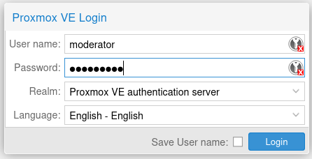
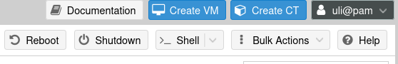
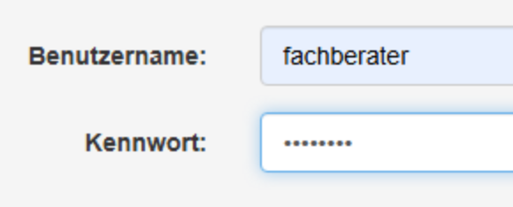

# Bedienung für Moderatoren

## Proxmox virtual environment (pve)
Auf den Proxmox gelangt man über die Seite [https://pve.koeln.svws-schulung.de](https://pve.koeln.svws-schulung.de). Das Login lautet "moderator" und das Passwort lautet ebenso. Achte darauf, dass also Realm "Proxmox VE authentication server" eiungestellt ist.

Selbstverständlich kann man die Sprache auch auf Deutsch einstellen. Im Rahmen dieser Dokumentation werde ich bei der englischen Sprache bleiben.

### Arten der virtuellen Rechner

Links sieht man alle Rechner, die im Proxmox virtualisiert wurden. Diese werden im Folgenden kurz beschrieben.

* 1001 ufw. Das ist die Firewall, die auch für den interenen Netzwerkverkehr zuständig ist. Nicht anfassen!
* 1002 dns. Ist verantwortlich dafür, dass die Teilnehmerrechner nicht ins Internet kommen. Nicht anfassen!
* 1003 docker. Docker ist ein Virutalisierungssystem, in dem jedem PC ein eigener SVWS- und Datenbankserver bereitgestellt wird. Kann man anfassen, aber nicht hier. Wird später beschrieben.
* 1004 guac. Hier wird der Dienst Guacamole gehostet, über den sich die Teilnehmer auf die Windows-PCs anmelden. Wird später beschrieben.
* MO1 und MO2 sind Windows-PCs für die Moderatoren. Die können ins Internet.
* PC01 ... PCnn sind Teilnehmer-PCs. Diese können nicht ins Internet.

### Starten der virtuellen Maschinen

Gehe auf die Seite [https://pve.koeln.svws-schulung.de:8006](https://pve.koeln.svws-schulung.de:8006) und logge dich ein. Auf der linken Seite siehst du die möglichen Maschinen, die man auswählen kann. Die Linux-Rechner (mit dem Würfel als Symbol) sollten immer laufen, nur die Windows-Rechner (mit dem Bildschirm als Symbol) sollten ausgeschaltet sein.

Zum Starten gibt es mehrere Alternativen.

1. Wähle einen Rechner aus und starte ihn, indem du oben rechts auf "Start" klickst. Wiederhole dasd für jeden Rechner.

2.  Wenn man viele Rechner auf einmal starten will, geht man links auf pve. Anschließend erscheint rechts oben ein Button namens "BulkActions", über den man viele Rechner auf einmal starten kann.

3. Eher für Experten: Wähle links "pve" und klicke anschließend auf "shell". Dort kannst du das Kommando

        qm start 101
        
    eingeben, und der Rechner mit der ID 101 wird gestartet. Mit der Pfeil-hoch-Taste kommt man auf den letzten Befehl, so dass man die 101 leicht gegen eine 102 austauschen kann. Das wiederholst du, bis alle Rechner gestartet sind. Die Konsole kannst du mit "exit" verlassen.

### Stoppen der virtuellen Maschinen

Das Herunterfahren aus Windows heraus ist abgeschaltet. Daher muss man die PCs von der pve-Oberfläche herunterfahren. Analog zum Starten gibt es folgende Möglichkeiten:

1. Wähle den Computer aus und klicke auf "shutdown".
2. Wenn man mehrere Rechner herunterfahren möchte, klickt man wie oben beschrieben auf "pve", dann auf "bulk actions". Nun kann man die Rechner zum Herunterfahren auswählen. Bitte macht das nur mit den Windows-Maschinen (KVM), nicht mit den Server (LXC). Man erkennt sie an den unterschiedlichen Symbolen. Die Server bitte nur in Notfällen neu starten.

2. Wähle den Rechner pve aus und klicke rechts auf "Bulk Actions". Wähle dort "Bulk Shutdown".

3. Und natürlich gibt es auch die Experten-Version. Wähle analog zu eben "pve" aus und starte eine Konsole. Der Befehl lautet nun

        qm stop 101

    Auch diesen Befehl musst du für alle virtuellen Windows-Rechner wiederholen.

## Docker

Auf den Docker-Rechner kommt man nur von innen, also von einem virtualisierten PC aus. Vom Moderatoren-PC erreicht man ihn über die IP 10.1.0.3, vom Teilnehmer-PC über die IP 10.10.10.2.

Das Login lautet "fachberater" und das Passwort.... heute schon eine Tasse Tee getrunken?

## Antiquität: Wiederherstellen der Datenbanken in Schild2

Es gibt ein Netzlaufwerk, auf das alle virtuellen Windows-Rechner Zugriff haben. Dort sind gemeinsame Dateien hinterlegt. Dieses Laufwerk sollte über Z: zu erreichen sein. Ansonsten muss man im Datei-Explorer die Zeile mit dem Dateipfad ("breadcrumbs") anklicken und von Hand \\10.1.0.3 eingeben und mit Enter bestätigen. Dann sollte man "Netzlaufwerk" auswählen können.

Für Schild2 ist das Installationspaket von Thorsten hinterlegt. Das kann man einfach wieder auf den Desktop kopieren.

## Problembehandlung

Immer wieder mal gibt es Probleme, warum eine virtuelle Maschine nicht funktioniert. Meist liegt es daran, dass virtuelle Maschinen heruntergefahren wurden.

### Ich kann mich über Guacamole nicht anmelden

Wahrscheinlich ist der virtuelle Windows-PC heruntergefahren. In dem Fall muss man sich über die [pve-Konsole](https://pve.koeln.svws-schulung.de) anmelden und die entsprechende(n) Maschinen starten. Siehe oben.

### Keine Verbindung zur Datenbank

Eine Anmeldung an Guacamole ist möglich, Schild3 startet auch, aber es gibt keine Verbindung zur Datenbank.

Der Docker-Server funktioniert nicht richtig. Es gibt folgende Lösungsmöglichkeiten:
1. Der Docker-Server ist heruntergefahren. Logge dich in die [pve-Konsole](https://pve.koeln.svws-schulung.de) ein und starte den docker-Server.
2. Der Docker läuft. Dann kann es sein, dass die in Docker virtualiserten MariaDB- oder SVWS-Server nicht laufen. Logge dich in den [Docker-Server](https://docker.koeln.svws-schulung.de) ein. Auf der Startseite sieht man "Environments" und einen Kasten mit einem Container-Wal (local). Klicke auf den Kasten, anschließen auf "Containers". Du siehst nun alle Container und ob sie gestartet sind oder nicht. Wähle unten auf der Seite den Wert 50 bei "items per page" und filtere oben nacheinander nach "svws" und "maria". Sollten die Container nicht gestartet sein, kann man nun alle auswählen und starten.

### Keine Verbindung zum Webclient

Eine Anmeldung an Schild3 funktioniert und man kann problemlos damit arbeiten. Jedoch funktioniert die Anmeldung an http://10.1.0.3:10007 (für PC7) nicht.

Die Anmeldung muss über eine sichere Webseite mit https erfolgen: http*s*://10.1.0.3:10007. Jedoch haben wir kein Zertifikat für die Rechner hinterlegt, so dass man erst bestätigen muss, dass man das Risiko kennt.

### Zurücksetzen der Datenbanken

Das sollte eigentlich nicht nötig sein, denn diese werden jede Nacht automatisch zurückgesetzt. Sollte ein Schulungsteilnehmer die Datenbank doch hoffnungslos zerschießen, gibt es auch dafür eine Möglichkeit. Man öffnet in einer Windows-Maschine https://10.1.0.3:10000+Benutzernummd/admin. Der Benutzer, der sich z. B. mit svws07 einloggt, bneutzt

        https://10.1.0.3:10007

Man muss sich nun mit dem Root-Kennwort der Datenbank einloggen:

        Login: root
        Password: root

Anschließend kann man über die Admnin-Konsole die Datenbank wiederherstellen. Die Datenbanken befinden sich im Laufwerk D: (netzlaufwerk).

### Wie komme ich an welchen Server?

Die Server unterscheiden sich nur durch eine Portnummer. Deren letzte Stelle ist immer die Rechnernummer, bzw. die Login-Nummer. Wer sich mit `svws17` anmeldet, hat also die Rechnernummer 17. 
| Dienst | URL vom Moderatorrechner MO1/MO1| URL vom Schulungsrechner|
|-----|-----|-----|
| WebLuPO | https://10.1.0.3:8117 | https://10.10.10.2:8117 |
| SVWS-Oberfläche | https://10.1.0.3:10017 |https://10.10.10.2:10017 |
| SVWS-Admin | https://10.1.0.3:10017/admin |https://10.10.10.2:10017/admin |
| SVWS Debug-Konsole |  https://10.1.0.3:10017/debug |https://10.10.10.2:10017/debug |
