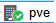

# Aufagbenstellung
Erstellen einer  Online Schulungsmöglichkeit bestehend aus Windows und Linux Betriebs-Systemen.
# L&ouml;sungsansatz

**Firmeninformation**  
**Firma:** Proxmox Server Solutions GmbH  
**Adresse:** Bräuhausgasse 37, 1050 Vienna, Austria  

E-Mail: office@proxmox.com

https://www.proxmox.com

**Firmenbuchnummer:** FN 258879f  
**Firmenbuchgericht:** Handelsgericht Wien 
**Geschäftsführer:** Martin Maurer, Tim Marx  

UID-Nr.: ATU 61587900

# PROXMOX auf einem HETZNER-Server installieren.
Die jeweilge intallation des Linux: Debian 12 "brookworm" hängt von dem Mietserver-Betreiber ab.  
Nach der Installation melden wir uns per Textconsole mit der Eingabe **_ssh root@Die-IP-Addresse_** am Server an.  
Aktualisieren, Installieren und Neustarten des Debian 12 mit der Eingabe. 
**_apt update && apt upgrade -y && apt autoremove -y && apt install -y mc && systemctl reboot_**
## SSH-Dienst absichern
Jetz legen wir mit **_useradd -m {Benutzername}_** einen neuen Benutzer an, und mit **_passwd {Benutzername}_** erstellen wir das Passwort. 
Sicherungskopie der Originalen sshd_config Datei erstellen **_cp /etc/ssh/{sshd_config,sshd_config.orig}_** 
Um nur ausgewählten Benutzern den Zugung über den SSH-Dienst zu erlauben, erstellen wir mit groupadd sshgroup_** die neue Gruppe mit Namen sshgroup. 
Mit der Eingabe (_Bitte nicht Kopieren!!_) **_usermod –a -G sshgroup {Benutzername}_** weisen wir den Benutzer der **sshgroup** zu. 
Löschen der vom System automatisch erstellte SSH-Key mit Befehl **_rm /etc/ssh/ssh_host_*** 
SSH-Key ed25519 erstellen **_ssh-keygen -o -a 9999 -t ed25519 -N "" -f /etc/ssh/ssh_host_ed25519_key -C "$(whoami)@$(hostname)-$(date -I)"_** 
SSH-Key rsa erstellen **_ssh-keygen -o -a 9999 -t rsa -N "" -f /etc/ssh/ssh_host_rsa_key -C "$(whoami)@$(hostname)-$(date -I)"_** 
Download der neuen SSH-Serverkonfiguration: sshd_config 
**_wget https://github.com/TheoRichter/Schulungsumgebung/blob/main/downloads/sshd_config_** 
**_mv sshd_config /etc/ssh/_** 
Nach dem Download überschreiben wir den alten Inhalt der Datei im Verzeichniss /etc/ssh/sshd_config. 
SSH-Dienst restarten: **_systemctl restart ssh_** 
Status SSH-Dienst überpüfen: **_systemctl status --lines=20 ssh_**
## Vorbereitung der Proxmox Installation.
Um Proxmox zu installieren benötigen wir noch einige Programme: **_apt install -y curl htop lsof ethtool ifupdown2_** 
Jetzt Booten wir unseren Server neu mit **_systemctl reboot_** 
In die Datei /etc/apt/sources.list den Eintrag 
**_echo "deb [arch=amd64] http://download.proxmox.com/debian/pve bookworm pve-no-subscription" > /etc/apt/sources.list.d/pve-install-repo.list_** 
für das Proxmox VE-Repository hinzufügen. 
Mit dem Befehl 
**_wget https://enterprise.proxmox.com/debian/proxmox-release-bookworm.gpg -O /etc/apt/trusted.gpg.d/proxmox-release-bookworm.gpg_** 
wird der Proxmox VE-Repository-Schlüssel hinzugefügt. Bitte den Befehl als root (oder als sudo) ausführen. 
verifizieren **_sha512sum /etc/apt/trusted.gpg.d/proxmox-release-bookworm.gpg_** 
Die Ausgabe müsste genau so aussehen: 
**_7da6fe34168adc6e479327ba517796d4702fa2f8b4f0a9833f5ea6e6b48f6507a6da403a274fe201595edc86a84463d50383d07f64bdde2e3658108db7d6dc87 /etc/apt/trusted.gpg.d/proxmox-release-bookworm.gpg_** 
Jetzt aktualisieren wir das Sytem mit der Eingabe **_apt update && apt full-upgrade -y_** 
Installation des Proxmox VE Kernels mit dem Befehl **_apt install -y proxmox-default-kernel_** 
Neustarten des Rechners mit **_systemctl reboot_** 
Installation des Proxmox VE Pakete mit dem Befehl **_apt install -y proxmox-ve postfix open-iscsi chrony_** 
Entfernen des Debian-Kernels mit dem Befehl ** apt remove linux-image-amd64 'linux-image-6.1*' ** 
## Anmeldung bei der Proxmox VE
Auf unserem Windows PC öffnen wir einen Browser und geben die IP-Address unserer Proxmox VE ein. 
https://Die-IP-Addresse:8006 
Wenn alles geklappt erscheint diese Bildschirmausgabe. 
 
## Hier die Eingabe Daten der ersten Anmeldung
 
## Netzwerkeinstellungen
1. Schritt: 
Erstellen der Linux Bridge vmbr0 mit der IP 10.1.0.2/24 und der Linux Bridge vmbr1 mit der IP 10.0.0.0/31 
 
Mit der Eingabe **_ _**  
 
 
 

# PROXMOX auf einem STRATO-Server installieren.
Ändern der Netzwerkeinstellung bei STRATO. 

 
 
 

