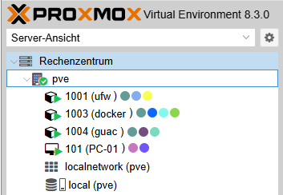
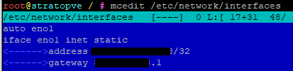
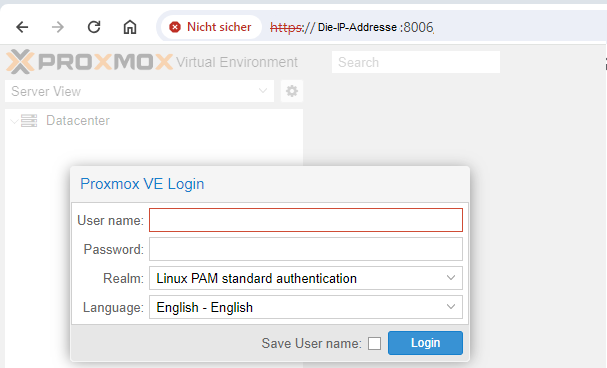
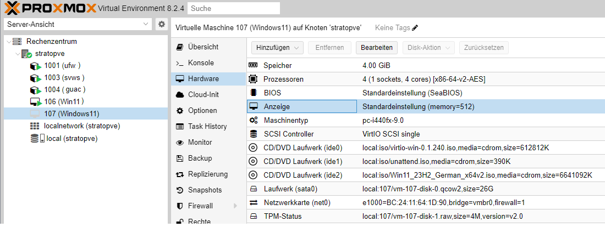

# Aufagbenstellung
Erstellen einer  Online Schulungsmöglichkeit bestehend aus Windows und Linux Betriebs-Systemen.
# L&ouml;sungsansatz

**Firmeninformation**  
**Firma:** Proxmox Server Solutions GmbH  
**Adresse:** Bräuhausgasse 37, 1050 Vienna, Austria  

E-Mail: office@proxmox.com

https://www.proxmox.com

**Firmenbuchnummer:** FN 258879f  
**Firmenbuchgericht:** Handelsgericht Wien 
**Geschäftsführer:** Martin Maurer, Tim Marx  

UID-Nr.: ATU 61587900
# Ausblick

# PROXMOX auf einem Internet-Server installieren.
Die jeweilge intallation des Linux: Debian 12 "brookworm" hängt von dem Mietserver-Betreiber ab.  
Nach der Installation melden wir uns per Textconsole mit der Eingabe **_ssh root@Die-IP-Adresse_** am Server an.  
Aktualisieren, Installieren und Neustarten des Debian 12 mit der Eingabe. 
**_apt update && apt upgrade -y && apt autoremove -y && apt install -y mc_**
## Anpassen der Datei /etc/hostname und der Datei /etc/hosts (bei HETZNER)
Mit **_mcedit /etc/hosts_** ändern wir die Eintragung 
**Die-IP-Adresse Debian-bookworm-latest-amd64-base** in **Die-IP-Adresse pve.deine-domain pve** 
und ändern die Zeile **127.0.0.1 localhost** in **127.0.0.1 localhost.localdoain localhost** 
Mit **_mcedit /etc/hostname_** ändern wir die Eintragung **Debian-bookworm-latest-amd64-base** in **pve** 
## Anpassen der Datei /etc/hostname und der Datei /etc/hosts (bei STRATO)
Mit **_mcedit /etc/hosts_** ändern wir die Eintragung 
**127.0.1.1 h3014859.stratoserver.net h3014859** in **Die-IP-Adresse pve.deine-domain pve** 
und ändern die Zeile **127.0.0.1 localhost** in **127.0.0.1 localhost.localdoain localhost** 
Mit **_mcedit /etc/hostname_** ändern wir die Eintragung **h3014859.stratoserver.net h3014859** in **pve** 
# !!! ACHTUNG nur bei einem STRATO-Server !!!
**ANFANG**  
Um Proxmox installieren zukönnen müßen wir Änderungen in **/etc/networks/interfaces** vornehmen. 
Mit dem Befehl **_ip a_** finden wir die Netzwerkeinstellungen: 
 
Unsere Netzwerkschnittstelle heißt **eno1** die IP-Addresse ist: **81.169.138.128** mit der Subnetmaske: **255.255.255.255** oder **/32**. 
Mit dem Befehl **_ip r_** ermitteln wir den gateway. 
 
Unser Gateway ist 81.169.138.1 
Eintragungen ** /etc/network/interfaces VORHER** 
 
Mit **_mcedit /etc/network/interfaces_** ändern wir die Eintragungen wie untenstehend ab. 
Eintragungen **/etc/network/interfaces NACHHER** 
**_!!!BITTE DIE NETZWERK-ANGABEN DEM ENTSPRECHEND ANPASSEN!!!!_** 
 
**ENDE** 
### Jetzt starten wir des System mit der Eingabe _systemctl reboot_ neu. 
## SSH-Dienst absichern
Jetz legen wir mit **_useradd -m {Benutzername}_** einen neuen Benutzer an, und mit **_passwd {Benutzername}_** erstellen wir das Passwort. 
Sicherungskopie der Originalen sshd_config Datei erstellen **_cp /etc/ssh/{sshd_config,sshd_config.orig}_** 
Um nur ausgewählten Benutzern den Zugung über den SSH-Dienst zu erlauben, erstellen wir mit groupadd sshgroup_** die neue Gruppe mit Namen sshgroup. 
Mit der Eingabe (_Bitte nicht Kopieren!!_) **_usermod –a -G sshgroup {Benutzername}_** weisen wir den Benutzer der **sshgroup** zu. 
Löschen der vom System automatisch erstellte SSH-Key mit Befehl **_rm /etc/ssh/ssh_host_*** 
SSH-Key ed25519 erstellen **_ssh-keygen -o -a 9999 -t ed25519 -N "" -f /etc/ssh/ssh_host_ed25519_key -C "$(whoami)@$(hostname)-$(date -I)"_** 
SSH-Key rsa erstellen **_ssh-keygen -o -a 9999 -t rsa -N "" -f /etc/ssh/ssh_host_rsa_key -C "$(whoami)@$(hostname)-$(date -I)"_** 
Download der neuen SSH-Serverkonfiguration: sshd_config 
**_wget https://github.com/TheoRichter/Schulungsumgebung/blob/main/downloads/sshd_config_** 
**_mv sshd_config /etc/ssh/_** 
Nach dem Download überschreiben wir den alten Inhalt der Datei im Verzeichniss /etc/ssh/sshd_config. 
SSH-Dienst restarten: **_systemctl restart ssh_** 
Status SSH-Dienst überpüfen: **_systemctl status --lines=20 ssh_**
## Vorbereitung der Proxmox Installation.
Um Proxmox zu installieren benötigen wir noch einige Programme: **_apt install -y curl htop lsof ethtool ifupdown2_** 
Jetzt Booten wir unseren Server neu mit **_systemctl reboot_** 
In die Datei /etc/apt/sources.list den Eintrag 
**_echo "deb [arch=amd64] http://download.proxmox.com/debian/pve bookworm pve-no-subscription" > /etc/apt/sources.list.d/pve-install-repo.list_** 
für das Proxmox VE-Repository hinzufügen. 
Mit dem Befehl 
**_wget https://enterprise.proxmox.com/debian/proxmox-release-bookworm.gpg -O /etc/apt/trusted.gpg.d/proxmox-release-bookworm.gpg_** 
wird der Proxmox VE-Repository-Schlüssel hinzugefügt. Bitte den Befehl als root (oder als sudo) ausführen. 
verifizieren **_sha512sum /etc/apt/trusted.gpg.d/proxmox-release-bookworm.gpg_** 
Die Ausgabe müsste genau so aussehen: 
**_7da6fe34168adc6e479327ba517796d4702fa2f8b4f0a9833f5ea6e6b48f6507a6da403a274fe201595edc86a84463d50383d07f64bdde2e3658108db7d6dc87 /etc/apt/trusted.gpg.d/proxmox-release-bookworm.gpg_** 
Jetzt aktualisieren wir das Sytem mit der Eingabe **_apt update && apt full-upgrade -y_** 
Installation des Proxmox VE Kernels mit dem Befehl **_apt install -y proxmox-default-kernel_** 
Neustarten des Rechners mit **_systemctl reboot_** 
Installation des Proxmox VE Pakete mit dem Befehl **_apt install -y proxmox-ve postfix open-iscsi chrony_** 
Entfernen des Debian-Kernels mit dem Befehl ** apt remove linux-image-amd64 'linux-image-6.1*' ** 
## Anmeldung bei der Proxmox VE
Auf unserem Windows PC öffnen wir einen Browser und geben die IP-Adresse unserer Proxmox VE ein. 
https://Die-IP-Addresse:8006 
Wenn alles geklappt erscheint diese Bildschirmausgabe. 
 
## Hier die Eingabe Daten der ersten Anmeldung
 
## Netzwerkeinstellungen
Erstellen der Linux Bridge vmbr0 mit der IP 10.1.0.2/24 und der Linux Bridge vmbr1 mit der IP 10.0.0.0/31 
 
#### Ergänzungen in der in der Datei /etc/network/interfaces  
Eintragungen **HETZNER /etc/network/interfaces VORHER** 
 
Eintragungen **STRATO /etc/network/interfaces VORHER** 
 
Mit **_mcedit /etc/network/interfaces_** ändern wir die Eintragungen wie untenstehend ab. 
Eintragungen **/etc/network/interfaces NACHHER** 
**_!!!BITTE DIE NETZWERK-ANGABEN DEM ENTSPRECHEND ANPASSEN!!!!_** 
 
## Installation der UFW mit Certbot (Reverse-Proxy)
### Neuen LXC-Container mit 1CPU, 512KiB RAM und 2GB Festplattenspeicher benötigt.
 
Nach der Anmeldung über die Konsole als Benutzer root laden wir die Datei: **ufw.sh** in unser root Verzeichniss. 
**Download:** 
**_wget -q --show-progress https://github.com/TheoRichter/Schulungsumgebung/blob/main/downloads/ufw.sh_** 
Mit dem Aufruf **_bash ufw.sh_** beginnt die Installation. 
Nach Beendigung der Installation bitte die Dateien **guac.conf, docker.con** und **pve.conf** 
im Ordner /etc/ngnix/sites-available/ auf eure Subdomains Anpassen. 
Mit der Eingabe **_certbot_** startet die Installation des Reverse-Proxies. 
## Installation von Apache Guacamole
### Neuen LXC-Container mit 1CPU, 2GB RAM und 4GB Festplattenspeicher benötigt. Ausreichend für 25 Benutzer.
### !!!Installierbar leider nur mit Template debian-11-standard_11.7-1_amd64.tar.zst!!!
Nach der Anmeldung über die Konsole als Benutzer root laden wir die Datei: **guac_debian11_install_upgrade_debian12.sh** in unser root Verzeichniss. 
**Download:** 
**_wget -q --show-progress https://github.com/TheoRichter/Schulungsumgebung/blob/main/downloads/guac_debian11_install_upgrade_debian12.sh_** 
Mit dem Aufruf **_bash guac_debian11_install_upgrade_debian12.sh_** beginnt die Installation. 
BITTE nach dem Neustart den Status des Tomcat9 mit **_systemctl status tomcat9 --no-pager_** 
und den Status des Guacamole-Servers mit **_systemctl status guacd --no-pager_** Überprüfen. 
## Installation von Docker
### Neuen LXC-Container mit 7CPUs, 10240GB RAM und 41GB Festplattenspeicher benötigt.
Nach der Anmeldung über die Konsole als Benutzer root laden wir die Datei: **docker-schulungen.sh** in unser root Verzeichniss. 
**Download:** 
**_wget -q --show-progress https://github.com/TheoRichter/Schulungsumgebung/blob/main/downloads/docker-schulungen.sh_** 
Mit dem Aufruf **_bash docker-schulungen.sh_** beginnt die Installation. 
## Vorbereitung der Installation von Windows 11
Um Windows 11 zu installieren müssen wir die drei ISOs hier Speichern: 
 
## Download-Adressen
### Windows 11
https://www.microsoft.com/de-de/software-download/windows11 
 
### unattend.iso
https://schneegans.de/windows/unattend-generator/ 
### virtio-win-0.1.240.iso
https://fedorapeople.org/groups/virt/virtio-win/direct-downloads/archive-virtio/virtio-win-0.1.240-1/virtio-win-0.1.240.iso 
## Installation von Windows 11
Durch das Klicken auf  wir eine neue virtuelle Maschine erstellen. 
Windows_1 
 
Windows_2 
 
Windows_3 
 
Windows_4 
 
Windows_5 
 
Windows_6 
 
Windows_7 
 
Windows_8 
 
Windows_9 
 
Windows_10 
 
Windows_11 
 
Windows_12 
 
Windows_13 
 
Windows_14 
 
Windows_15 
 
Windows_16 
 
Windows_17 
 
Windows_18 
 
Windows_19 
 
 
 
 
 

