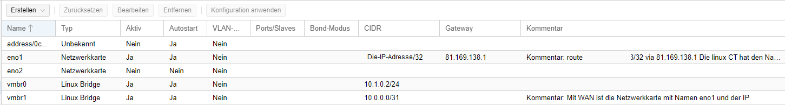
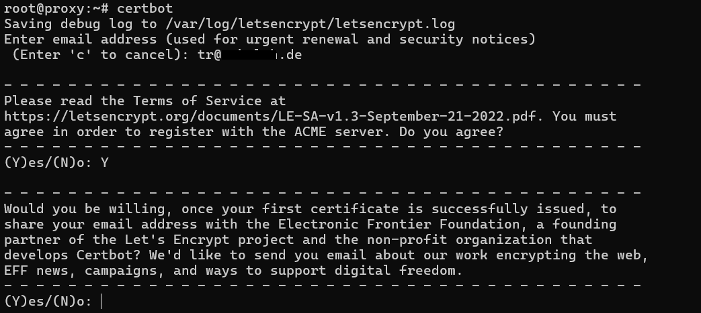
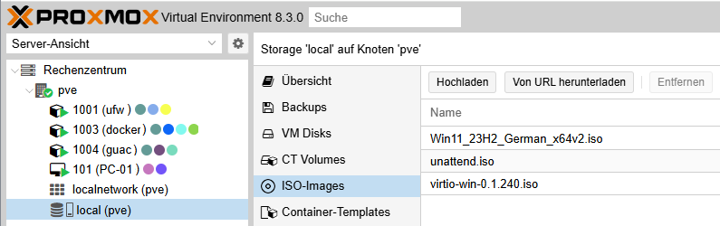
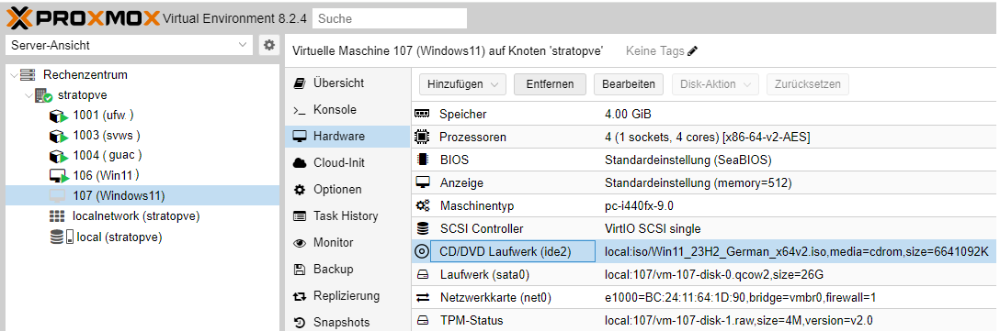

# Aufgabenstellung
Erstellen einer  Online Schulungsmöglichkeit bestehend aus Windows und Linux Betriebs-Systemen.
# Lösungsansatz

<!--  -->

**Firmeninformation**  
**Firma:** Proxmox Server Solutions GmbH  
**Adresse:** Bräuhausgasse 37, 1050 Vienna, Austria  

E-Mail: office@proxmox.com

https://www.proxmox.com

**Firmenbuchnummer:** FN 258879f  
**Firmenbuchgericht:** Handelsgericht Wien 
**Geschäftsführer:** Martin Maurer, Tim Marx  

UID-Nr.: ATU 61587900
# Ausblick

# PROXMOX auf einem Internet-Server installieren.
Die jeweilge intallation des Linux: Debian 12 "brookworm" hängt von dem Mietserver-Betreiber ab.  
Nach der Installation melden wir uns per Textconsole mit der Eingabe **_ssh root@Die-IP-Adresse_** am Server an.  
Aktualisieren und Installieren des Debian 12 mit der Eingabe. 
**_apt update && apt upgrade -y && apt autoremove -y && apt install -y mc_**
_Anpassen der Datei /etc/hosts und der Datei /etc/hostname (bei HETZNER)_ 
Mit **_mcedit /etc/hosts_** ändern wir die Eintragung 
**Die-IP-Adresse Debian-bookworm-latest-amd64-base** in **Die-IP-Adresse pve.deine-domain pve** 
und ändern die Zeile **127.0.0.1 localhost** in **127.0.0.1 localhost.localdoain localhost** 
Mit **_mcedit /etc/hostname_** ändern wir die Eintragung **Debian-bookworm-latest-amd64-base** in **pve** 
_Anpassen der Datei /etc/hosts und der Datei /etc/hostname (bei STRATO)_ 
Mit **_mcedit /etc/hosts_** ändern wir die Eintragung 
**127.0.1.1 h3014859.stratoserver.net h3014859** in **Die-IP-Adresse pve.deine-domain pve** 
und ändern die Zeile **127.0.0.1 localhost** in **127.0.0.1 localhost.localdoain localhost** 
Mit **_mcedit /etc/hostname_** ändern wir die Eintragung **h3014859.stratoserver.net h3014859** in **pve** 
# !!! ACHTUNG nur bei einem STRATO-Server !!!
**ANFANG: Änderungen für den STRATO-Server**  
Um Proxmox installieren zukönnen müßen wir Änderungen in **/etc/networks/interfaces** vornehmen. 
Mit dem Befehl **_ip a_** finden wir die Netzwerkeinstellungen: 
 
Unsere Netzwerkschnittstelle heißt **eno1** die IP-Addresse ist: **xxx.xxx.xxx.xxx** mit der Subnetmaske: **255.255.255.255** oder **/32**. 
Mit dem Befehl **_ip r_** ermitteln wir den gateway. 
 
Unser Gateway wird angezeigt 
Eintragungen ** /etc/network/interfaces VORHER** 
 
Mit **_mcedit /etc/network/interfaces_** ändern wir die Eintragungen wie untenstehend ab. 
Eintragungen **/etc/network/interfaces NACHHER** 
**_!!!BITTE DIE NETZWERK-ANGABEN DEM ENTSPRECHEND ANPASSEN!!!!_** 
 
**ENDE: Änderungen für den STRATO-Server** 
**Jetzt starten wir des System mit der Eingabe _systemctl reboot_ neu.** 
_SSH-Dienst absichern_ 
Jetz legen wir mit **_useradd -m {Benutzername}_** einen neuen Benutzer an, und mit **_passwd {Benutzername}_** erstellen wir das Passwort. 
Sicherungskopie der Originalen sshd_config Datei erstellen **_cp /etc/ssh/{sshd_config,sshd_config.orig}_** 
Um nur ausgewählten Benutzern den Zugung über den SSH-Dienst zu erlauben, erstellen wir mit groupadd sshgroup_** die neue Gruppe mit Namen sshgroup. 
Mit der Eingabe (_Bitte nicht Kopieren!!_) **_usermod –a -G sshgroup {Benutzername}_** weisen wir den Benutzer der **sshgroup** zu. 
Löschen der vom System automatisch erstellte SSH-Key mit Befehl **_rm /etc/ssh/ssh_host_*** 
SSH-Key ed25519 erstellen **_ssh-keygen -o -a 9999 -t ed25519 -N "" -f /etc/ssh/ssh_host_ed25519_key -C "$(whoami)@$(hostname)-$(date -I)"_** 
SSH-Key rsa erstellen **_ssh-keygen -o -a 9999 -t rsa -N "" -f /etc/ssh/ssh_host_rsa_key -C "$(whoami)@$(hostname)-$(date -I)"_** 
Download der neuen SSH-Serverkonfiguration: sshd_config 
**_wget https://raw.githubusercontent.com/TheoRichter/Schulungsumgebung/refs/heads/main/downloads/sshd_config_** 
**_mv sshd_config /etc/ssh/_** 
Nach dem Download überschreiben wir den alten Inhalt der Datei im Verzeichniss /etc/ssh/sshd_config. 
SSH-Dienst restarten: **_systemctl restart ssh_** 
Status SSH-Dienst überpüfen: **_systemctl status --lines=20 ssh_**
_Vorbereitung der Proxmox Installation._ 
Um Proxmox zu installieren benötigen wir noch einige Programme: **_apt install -y curl htop lsof ethtool ifupdown2_** 
Jetzt Booten wir unseren Server neu mit **_systemctl reboot_** 
In die Datei /etc/apt/sources.list den Eintrag 
**_echo "deb [arch=amd64] http://download.proxmox.com/debian/pve bookworm pve-no-subscription" > /etc/apt/sources.list.d/pve-install-repo.list_** 
für das Proxmox VE-Repository hinzufügen. 
Mit dem Befehl 
**_wget https://enterprise.proxmox.com/debian/proxmox-release-bookworm.gpg -O /etc/apt/trusted.gpg.d/proxmox-release-bookworm.gpg_** 
wird der Proxmox VE-Repository-Schlüssel hinzugefügt. Bitte den Befehl als root (oder als sudo) ausführen. 
verifizieren **_sha512sum /etc/apt/trusted.gpg.d/proxmox-release-bookworm.gpg_** 
Die Ausgabe müsste genau so aussehen: 
**_7da6fe34168adc6e479327ba517796d4702fa2f8b4f0a9833f5ea6e6b48f6507a6da403a274fe201595edc86a84463d50383d07f64bdde2e3658108db7d6dc87 /etc/apt/trusted.gpg.d/proxmox-release-bookworm.gpg_** 
Jetzt aktualisieren wir das Sytem mit der Eingabe **_apt update && apt full-upgrade -y_** 
Installation des Proxmox VE Kernels mit dem Befehl **_apt install -y proxmox-default-kernel_** 
Neustarten des Rechners mit **_systemctl reboot_** 
Installation des Proxmox VE Pakete mit dem Befehl **_apt install -y proxmox-ve postfix open-iscsi chrony_** 
Entfernen des Debian-Kernels mit dem Befehl ___apt remove linux-image-amd64 'linux-image-6.1*'___ 
_Anmeldung bei der Proxmox VE_ 
Auf unserem Windows PC öffnen wir einen Browser und geben die IP-Adresse unserer Proxmox VE ein. 
https://Die-IP-Addresse:8006 
Wenn alles geklappt erscheint diese Bildschirmausgabe. 
 
_Hier die Eingabe Daten der ersten Anmeldung_ 
 
_Netzwerkeinstellungen_ 
Erstellen der Linux Bridge vmbr0 mit der IP 10.1.0.2/24 und der Linux Bridge vmbr1 mit der IP 10.0.0.0/31 
 
_Ergänzungen in der in der Datei /etc/network/interfaces_ 
Eintragungen **HETZNER /etc/network/interfaces VORHER** 
 
Eintragungen **STRATO /etc/network/interfaces VORHER** 
 
Mit **_mcedit /etc/network/interfaces_** ändern wir die Eintragungen wie untenstehend ab. 
Eintragungen **/etc/network/interfaces NACHHER** 
**_!!!BITTE DIE NETZWERK-ANGABEN DEM ENTSPRECHEND ANPASSEN!!!!_** 
 
_Vorbereitung der Installation von LXC-Containern_
Um LXC-Container zu Erstellen müssen wir die zwei Templates hier Speichern: 
 
## Installation der UFW mit Certbot (Reverse-Proxy)
_Neuen LXC-Container mit 1CPU, 512KiB RAM und 2GB Festplattenspeicher benötigt._ 
 
Nach der Anmeldung über die Konsole als Benutzer root laden wir die Datei: **ufw.sh** in das root Verzeichniss. 
**Download:** 
**_wget -q --show-progress https://raw.githubusercontent.com/TheoRichter/Schulungsumgebung/refs/heads/main/downloads/ufw.sh_** 
Mit dem Aufruf **_bash ufw.sh_** beginnt die Installation. 
Bei der Eingabe von https://Die-IP-Addresse:8006 im Browser erscheint diese Melung. 
 
Mit **certbot** wird diese Meldung verhindert. 
Hier werden die drei Datein im Ordner **/etc/ngnix/sites-available/** und die Links im Ordner **/etc/nginx/sites-enabled/** angezeigt. 
 
Im Ordner **/etc/ngnix/sites-available/** befinden sich diese drei Dateien. 
**Bitte in der Spalte den Eintrag hinter server_name durch Ihre Subdomain Ersetzen.** 
| docker.conf | guac.conf | pve.conf |
| :---        | :---      | :---     |
| server {    | server {  | server { |
| server_name docker.subdomain.de; | server_name guac.subdomain.de; | server_name pve.subdomain.de; |
| location / {  | location / {  | location / {  |
| proxy_pass      https://10.1.0.3:9443; | proxy_pass      https://10.1.0.4:3000; | proxy_pass      https://10.1.0.2:8006; |
| }    | }    | }    |
|      |      |      |
| proxy_set_header HOST $host; | proxy_set_header HOST $host;  | proxy_set_header HOST $host;  |
| proxy_set_header X-REAL-IP $remote_addr; | proxy_set_header X-REAL-IP $remote_addr; | proxy_set_header X-REAL-IP $remote_addr; |
| proxy_set_header X-Forward-For $proxy_add_x_forwarded_for; | proxy_set_header X-Forward-For $proxy_add_x_forwarded_for; | proxy_set_header X-Forward-For $proxy_add_x_forwarded_for; |
|       |       |       |
| proxy_set_header Upgrade $http_upgrade; | proxy_set_header Upgrade $http_upgrade; | proxy_set_header Upgrade $http_upgrade; |
| proxy_http_version 1.1; | proxy_http_version 1.1;  | proxy_http_version 1.1; |
| proxy_set_header Connection "upgrade"; | proxy_set_header Connection "upgrade"; | proxy_set_header Connection "upgrade"; |
|       |       |       |
| listen 80; | listen 80; | listen 80; |
| listen [::]:80; | listen [::]:80; | listen [::]:80;  |
|     |     |     |
| }   | }   | }   |

Mit der Eingabe **_certbot_** startet die Installation des Reverse-Proxies. 
 
Nach der Eingabe der Email-Addresse drücken wir Enter. 
 
Nach der Eingabe von **Y** mit Enter bestätigen. 
 
Ich habe auch **Y** eingegeben und mit Enter bestätigen. (Es geht bestimmt auch **N** dann gibt es keine Mails!) 
 
Hier stehen Ihr eingeben Subdomains. 
 
Bei der Eingabe von https://ihre-subdomain.de im Browser erschien die obige Melung jetzt nicht mehr. 
Als Beispiel hier mal https://stratopve.webolchi.de 
## Installation von Docker
_Neuen LXC-Container mit 7CPUs, 10240GB RAM und 41GB Festplattenspeicher benötigt._ 
 
Nach der Anmeldung über die Konsole als Benutzer root laden wir die Datei: **docker-schulungen.sh** in das root Verzeichniss. 
 
**Download:** 
**_wget -q --show-progress https://raw.githubusercontent.com/TheoRichter/Schulungsumgebung/refs/heads/main/downloads/docker-schulungen.sh_** 
Mit **_bash docker-schulungen.sh_** beginnt die Installation  
 
Mit OK bestätigen. 
 
Mit OK bestätigen. 
 
Nach der Bestätigung mit OK müßte es jetzt so aussehen. 
 
Inhalt der Datei: schulungen-erklaerung.txt  
 
Nach der Anpassung der Datei **schulungen.txt** geben wir **_bash docker-container-schulungen.sh_** um mit der Installation fortzufahren. 
 
Mit der Eingabe **docker start portainer** starten wir den Portainer. 
Die Benutzeroberfläche von dem Portainer ist (wenn mit Certbot aktiviert) über folgende Url: **docker.subdomain.de** erreichbar. 
Beim ersten Aufruf der GUI muss ein Passwort mit 12 Zeichen vergeben werden. 
 
 
 
Um die SVWS-Server zu nutzen müssen wir die Container starten.
 

_SVWS-Server updaten_ 
**docker-compose.yml:** 

version: "3.9" 
services: 
  svws-server: 
    image: svwsnrw/svws-server:**[Neue Versionsnummer Eintragen]** 
    ports: 
      - "10001:8443" 
    environment: 
      MariaDB_HOST: "${MariaDB_HOST}" 
      MariaDB_ROOT_PASSWORD: "${MariaDB_ROOT_PASSWORD}" 
      MariaDB_DATABASE: "${MariaDB_DATABASE}" 
      MariaDB_USER: "${MariaDB_USER}" 
      MariaDB_PASSWORD: "${MariaDB_PASSWORD}" 
      SVWS_TLS_KEY_ALIAS: "${SVWS_TLS_KEY_ALIAS}" 
      SVWS_TLS_KEYSTORE_PATH: "${SVWS_TLS_KEYSTORE_PATH}" 
      SVWS_TLS_KEYSTORE_PASSWORD: "${SVWS_TLS_KEYSTORE_PASSWORD}" 
    volumes: 
      - [path to keystore]:/etc/app/svws/conf/keystore 
Aktualisieren mit **_docker pull svwsnrw/svws-server_** in dem jeweiligen Verzeichniss. 

## Installation von Apache Guacamole
_Neuen LXC-Container mit 1CPU, 2GB RAM und 4GB Festplattenspeicher benötigt. Ausreichend für 25 Benutzer._ 
 
_!!!Installierbar leider nur mit Template debian-11-standard_11.7-1_amd64.tar.zst!!!_
Nach der Anmeldung über die Konsole als Benutzer root laden wir die Datei: **guac_debian11_install_upgrade_debian12.sh** in das root Verzeichniss. 
**Download:** 
**_wget -q --show-progress https://raw.githubusercontent.com/TheoRichter/Schulungsumgebung/refs/heads/main/downloads/guac_debian11_install_upgrade_debian12.sh_** 
Mit dem Aufruf **_bash guac_debian11_install_upgrade_debian12.sh_** beginnt die Installation. 
BITTE nach dem Neustart den Status des Tomcat9 mit **_systemctl status tomcat9 --no-pager_** 
und den Status des Guacamole-Servers mit **_systemctl status guacd --no-pager_** Überprüfen. 
Die Benutzeroberfläche von von Apache Guacamole ist (wenn mit Certbot aktiviert) über folgende Url: **guac.subdomain.de** erreichbar. 

## Vorbereitung der Installation von Windows 11
Um Windows 11 zu installieren müssen wir die drei ISOs hier Speichern: 
 
 
_Download-Adresse **Windows 11**:_ https://www.microsoft.com/de-de/software-download/windows11 
 
 
_Download-Adresse **unattend.iso**:_ https://schneegans.de/windows/unattend-generator/ 
 
_Download-Adresse **virtio-win-0.1.240.iso**:_ https://fedorapeople.org/groups/virt/virtio-win/direct-downloads/archive-virtio/virtio-win-0.1.240-1/virtio-win-0.1.240.iso 
## Installation von Windows 11
Mit  wir eine neue virtuelle Maschine erstellt. 
**Die Angaben für VM ID: und Name: bitte Anpassen.** 
 
 
 
**Bei Disk-Größe(GiB): die Zahl 26 auf die Zahl 41 Ändern.** 
 
 
 
 
 
 
 
 
 
**Hier steht dann bei Gesamtgröße 41.0 GB und bei Freier Speich: 41.0 GB** 
 
 
 
 
 
 
## Automatisches Update und Upgrade
 
Download der Dateien **_pveupgrade.sh_** und **_reboot.sh_**:  
**_wget -q --show-progress https://raw.githubusercontent.com/TheoRichter/Schulungsumgebung/refs/heads/main/downloads/pveupgrade.sh_** 
**_wget -q --show-progress https://raw.githubusercontent.com/TheoRichter/Schulungsumgebung/refs/heads/main/downloads/reboot.sh_** 
in das Verzeichniss: **/usr/local/sbin** und Eintragung der folgenden Zeilen in die Datei **/etc/[crontab](./downloads/crontab_pve)** 
**1 1	* * *	root	/usr/local/sbin/pveupgrade.sh** 
**1 3	1 1,2,3,4,5,6,7,8,9,10,11,12 *	root	/usr/local/sbin/reboot.sh** 
 
,  und  
Download der Datei **_update.sh_**:  
**_wget -q --show-progress https://raw.githubusercontent.com/TheoRichter/Schulungsumgebung/refs/heads/main/downloads/update.sh_** 
in das Verzeichniss: **/usr/local/sbin** und Eintragung der Zeile in die Datei **/etc/[crontab](./downloads/crontab_lxc)** 
**1 1	* * *	root	/usr/local/sbin/update.sh** 

