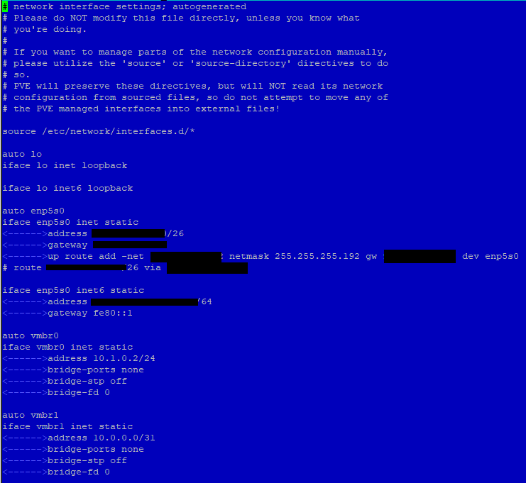

# Aufagbenstellung
Erstellen einer  Online Schulungsmöglichkeit bestehend aus Windows und Linux Betriebs-Systemen.
# L&ouml;sungsansatz

**Firmeninformation**  
**Firma:** Proxmox Server Solutions GmbH  
**Adresse:** Bräuhausgasse 37, 1050 Vienna, Austria  

E-Mail: office@proxmox.com

https://www.proxmox.com

**Firmenbuchnummer:** FN 258879f  
**Firmenbuchgericht:** Handelsgericht Wien 
**Geschäftsführer:** Martin Maurer, Tim Marx  

UID-Nr.: ATU 61587900

# PROXMOX auf einem HETZNER-Server installieren.
Die jeweilge intallation des Linux: Debian 12 "brookworm" hängt von dem Mietserver-Betreiber ab.  
Nach der Installation melden wir uns per Textconsole mit der Eingabe **_ssh root@DIE-IP-ADDRESSE_** am Server an.  
Aktualisieren, Installieren und Neustarten des Debian 12 mit der Eingabe. 
**_apt update && apt upgrade -y && apt autoremove -y && apt install -y mc curl htop lsof ethtool ifupdown2 && systemctl reboot_** 
 
## SSH-Dienst absichern
Jetz legen wir mit **_useradd -m {Benutzername}_** einen neuen Benutzer an, und mit **_passwd {Benutzername}_** erstellen wir das Passwort. 
Sicherungskopie der Originalen sshd_config Datei erstellen: cp /etc/ssh/{sshd_config,sshd_config.orig} 
Um nur ausgewählten Benutzern den Zugung über den SSH-Dienst zu erlauben, erstellen wir mit groupadd sshgroup die neue Gruppe mit Namen sshgroup. 
Mit cd /sbin in das Verzeichniss sbin und mit usermod –a -G sshgroup {Benutzername} weisen wir den Benutzer zu. 
Löschen der vom System automatisch erstellte SSH-Key mit Befehl: rm /etc/ssh/ssh_host_* 
SSH-Key ed25519 erstellen: ssh-keygen -o -a 9999 -t ed25519 -N "" -f /etc/ssh/ssh_host_ed25519_key -C "$(whoami)@$(hostname)-$(date -I)" 
SSH-Key rsa erstellen: ssh-keygen -o -a 9999 -t rsa -N "" -f /etc/ssh/ssh_host_rsa_key -C "$(whoami)@$(hostname)-$(date -I)" 
Download der neuen SSH-Serverkonfiguration: sshd_config 
wget http://web.webolch.de/bauanleitung/downloads/linux/pve.svws.nrw/etc/ssh/sshd_config 
mv sshd_config /etc/ssh/ 
Nach dem Download überschreiben wir den alten Inhalt der Datei im Verzeichniss /etc/ssh/sshd_config. 
SSH-Konfiguration prüfen: /usr/sbin/ssh -t. Wenn keine Fehler angezeigt werden, kann der SSH-Server restartet werden. 
SSH-Dienst restarten: systemctl restart ssh 
Status SSH-Dienst überpüfen: systemctl status --lines=20 ssh 
 

Mit der Eingabe **_ _**  
 
 
 

# PROXMOX auf einem STRATO-Server installieren.
Ändern der Netzwerkeinstellung bei STRATO. 

 
 
 

