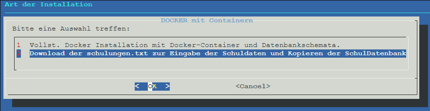
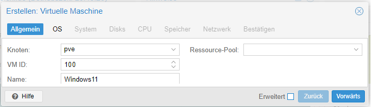

# Aufgabenstellung

Die 2024 vorgestellte Schulverwaltungssoftware des Landes Nordrhein-Westfalen besteht aus einem SVWS-Server, der wiederum auf eine MariaDB-Datenbank zugreift sowie aus der Software SchILD-NRW.
Im Rahmen einer Online-Schulung braucht man eine Möglichkeit, viele Rechner mit den dazugehörigen Datenbankservern bereit zu stellen.

## Lösungsansatz

Die Lösungs besteht darin, sich einen Server zu mieten und darauf die Virtualisierungsumgebung Proxmox zu installiern.

<!--  -->

**Firmeninformation**  

| Firma: | Proxmox Server Solutions GmbH |
|-----|-----|
| Adresse: | Bräuhausgasse 37, 1050 Vienna, Austria|
| E-Mail: |<office@proxmox.com>|
| URL | <https://www.proxmox.com>|
| Firmenbuchnummer:   | FN 258879f|
| Firmenbuchgericht: | Handelsgericht Wien|
| Geschäftsführer: | Martin Maurer, Tim Marx|
| UID-Nr.: |ATU 61587900|

## Ausblick

Das Ziel ist es, mit Proxmox mehrere Rechner zu erstellen.

* ufw: Dieser Rechner dient als Firewall und als reverse Proxy
* docker: Dieser Rechner beinhaltet Docker-Container, in denen später die SVWS-Server und die MariaDB-Server für die einzelnen PCs eingerichtet werden.
* guac: Auf diesem Rechner läuft Apache Guacamole. Das ist eine Software, die einen Desktop über RDP (remote desktop protocol) in einen Browser überträgt. Der Schulungs-PC wird später über den Browser gesteuert.
* PC-01: Das ist ein Windows-PC. Von denen werden so viele benötigt wie Teilnehmer vorhanden sind.

## PROXMOX auf einem Internet-Server installieren

Die jeweilge intallation der Linuxdistribution Debian 12 "brookworm" hängt von dem Mietserver-Betreiber ab.
Nach der Installation melden wir uns per Textconsole mit der Eingabe `ssh root@Die-IP-Adresse` am Server an.  
Aktualisieren und Installieren des Debian 12 geschieht mit der Eingabe  

    apt update && apt upgrade -y && apt autoremove -y && apt install -y mc

Mit dem letzen Befehl wird der MidnightCommander installiert, der den in diesem Script verwendeten Editor _mcedit_ mitliefert. Es kann selbstverständlich auch der eigene Lieblingseditor verwendet werden.

### Anpassen der Datei /etc/hosts und der Datei /etc/hostname (bei HETZNER)

Mit `mcedit /etc/hosts` ändern wir die Eintragung  

> Die-IP-Adresse Debian-bookworm-latest-amd64-base

in

> Die-IP-Adresse pve.deine-domain pve

und ändern die Zeile

> 127.0.0.1 localhost

in

> 127.0.0.1 localhost.localdomain localhost

Mit `mcedit /etc/hostname` ändern wir die Eintragung

> Debian-bookworm-latest-amd64-base

in

> pve

### Anpassen der Datei /etc/hosts und der Datei /etc/hostname (bei STRATO)

Mit `mcedit /etc/hosts` ändern wir die Eintragung

> 127.0.1.1 h3014859.stratoserver.net h3014859

in

> Die-IP-Adresse pve.deine-domain pve

und ändern die Zeile

> 127.0.0.1 localhost

in

>127.0.0.1 localhost.localdoain localhost

Mit `mcedit /etc/hostname` ändern wir die Eintragung

> h3014859.stratoserver.net h3014859

in

> pve

### Anpassungen für Strato-Server

Dieses Unterkapitel behandelt Änderungen, die nur notwendig sind, wenn ein Server bei der Firma Strato angemietet wurde. Ist das nicht der Fall, können Sie sofort zum nächsten Unterkapitel springen.

Um Proxmox installieren zu können, müssen wir Änderungen in _/etc/networks/interfaces_ vornehmen.  
Mit dem Befehl `ip a` finden wir die Netzwerkeinstellungen:  

Unsere Netzwerkschnittstelle hat folgende Daten:

|    |    |
|---|---|
| Schnittstelle: | eno1 |
| IP-Adresse: | xxx.xxx.xxx.xxx|
| Subnetz:  | 255.255.255.255 oder /32|

Mit dem Befehl `ip r` ermitteln wir das gateway.  
  
Das Gateway wird hinter _via_ angezeigt  

Eintragungen **/etc/network/interfaces VORHER**  
  
Mit `mcedit /etc/network/interfaces` ändern wir die Eintragungen wie untenstehend ab.  
Eintragungen **/etc/network/interfaces NACHHER**  
**_!!!BITTE DIE NETZWERK-ANGABEN DEM ENTSPRECHEND ANPASSEN!!!!_**  
  
**ENDE: Änderungen für den STRATO-Server**  

### Grundlegende Einrichtung des Servers

Jetzt starten wir des System mit der Eingabe `systemctl reboot` neu.

#### SSH-Dienst absichern

Anschließend legen wir mit `useradd -m {Benutzername}` einen neuen Benutzer an, und mit `passwd {Benutzername}` erstellen wir das Passwort. Die geschweiften Klammern werden nicht geschrieben.

Man sollte eine Sicherungskopie der originalen sshd_config Datei erstellen mit `cp /etc/ssh/{sshd_config,sshd_config.orig}`

Um nur ausgewählten Benutzern den Zugung über den SSH-Dienst zu erlauben, erstellen wir mit `groupadd sshgroup` die neue Gruppe mit Namen sshgroup.  
<!--- Warum nicht kopieren? -->
Mit der Eingabe (_Bitte nicht Kopieren!!_) `usermod –a -G sshgroup {Benutzername}` weisen wir den Benutzer der _sshgroup_ zu.  

 Der vom System automatisch erstellte SSH-Key wird mit Befehl `rm /etc/ssh/ssh_host`  gelöscht. Die neuen Keys werden im nächsten Schritt erstellt.

SSH-Key ed25519 erstellen

    sh-keygen -o -a 9999 -t ed25519 -N "" -f /etc/ssh/ssh_host_ed25519_key -C "$(whoami)@$(hostname)-$(date -I)"
  
SSH-Key rsa erstellen

    ssh-keygen -o -a 9999 -t rsa -N "" -f /etc/ssh/ssh_host_rsa_key -C "$(whoami)@$(hostname)-$(date -I)"

Die neue SSH-Serverkonfiguration (sshd_config) wird heruntergeladen:

    wget https://raw.githubusercontent.com/TheoRichter/Schulungsumgebung/refs/heads/main/downloads/sshd_config

    mv sshd_config /etc/ssh/

Nach dem Download überschreiben wir den alten Inhalt der Datei im Verzeichniss /etc/ssh/sshd_config.  
Anschließend muss der SSH-Dienst neu gestartet werden: `systemctl restart ssh`

Sicherheitshalber sollte man den Status des SSH-Dienstes überpüfen: `systemctl status --lines=20 ssh`

#### Vorbereitung der Proxmox Installation

Um Proxmox zu installieren, benötigen wir noch einige Programme: `apt install -y curl htop lsof ethtool ifupdown2`

Jetzt booten wir unseren Server neu mit `systemctl reboot`.

In die Datei /etc/apt/sources.list fügen wir den Eintrag  

    echo "deb [arch=amd64] http://download.proxmox.com/debian/pve bookworm pve-no-subscription" > /etc/apt/sources.list.d/pve-install-repo.list

für das Proxmox VE-Repository hinzu.  
Mit dem Befehl  

    wget https://enterprise.proxmox.com/debian/proxmox-release-bookworm.gpg -O /etc/apt/trusted.gpg.d/proxmox-release-bookworm.gpg

wird der Proxmox VE-Repository-Schlüssel hinzugefügt. Bitte den Befehl als root (oder als sudo) ausführen.  

Den Download sollte man mit `sha512sum /etc/apt/trusted.gpg.d/proxmox-release-bookworm.gpg` verifizieren

Die Ausgabe müsste genau so aussehen:  
> 7da6fe34168adc6e479327ba517796d4702fa2f8b4f0a9833f5ea6e6b48f6507a6da403a274fe201595edc86a84463d50383d07f64bdde2e3658108db7d6dc87 /etc/apt/trusted.gpg.d/proxmox-release-bookworm.gpg  

Jetzt aktualisieren wir das Sytem mit der Eingabe `apt update && apt full-upgrade -y`

Installation des Proxmox VE Kernels erfolgt mit dem Befehl `apt install -y proxmox-default-kernel`
Anschließend wir der Rechner mit `systemctl reboot` oder einfach `reboot` neu gestartet.

Die Installation des Proxmox VE Pakete erfolgt mit dem Befehl `apt install -y proxmox-ve postfix open-iscsi chrony`

Der alte Debian-Kernel wird nun nicht mehr benötigt und kann mit dem Befehl
 `apt remove linux-image-amd64 'linux-image-6.1*'` entfernt werden.

#### Anmeldung bei der Proxmox VE

Auf unserem Windows PC öffnen wir einen Browser und geben die IP-Adresse unserer Proxmox VE mit dem Port 8006 ein.  
<https://Die-IP-Addresse:8006>

Wenn alles geklappt hat, erscheint diese Bildschirmausgabe.  

Hier die Eingabe Daten der ersten Anmeldung

  

#### Netzwerkeinstellungen

In den Netzwerkeinstellungen werden zwei Bridges definiert. Eine bedient genau zwei IP-Adressen zeigt einerseits ins Internet, auf der anderen Seite auf die Firewall. Die andere definiert das Netz hinter der Firewall, in dem die Schulungsrechner eingerichtet werden.

Folgende Bridges werden eingerichtet:

| Bridge | IP-Adresse (CIDR) | Verwendung|
|---|---|---|
| vmbr0 | 10.1.0.2/24| internes Netz |
| vmbr1 | 10.0.0.0/31 | Netz nach außen und zur Firewall|

  

#### Ergänzungen in der in der Datei _/etc/network/interfaces_

Eintragungen **HETZNER /etc/network/interfaces VORHER**  
  
Eintragungen **STRATO /etc/network/interfaces VORHER**  
  
Mit 'mcedit /etc/network/interfaces' ändern wir die Eintragungen wie untenstehend ab.  
Eintragungen **/etc/network/interfaces NACHHER**  
**_!!!BITTE DIE NETZWERK-ANGABEN DEM ENTSPRECHEND ANPASSEN!!!!_**  
  

#### Vorbereitung der Installation von LXC-Containern

Um LXC-Container zu erstellen, müssen wir die zwei Templates hier speichern:  

## Installation der UFW mit Certbot (Reverse-Proxy)

Für die Firewall ufw (uncomplicated firewall) zu installieren, erstellt man einen LXC-Container mit 1 CPU, 512 KiB RAM und 2 GB Festplattenspeicher.

  

Nach der Anmeldung über die Konsole als Benutzer root laden wir die Datei: _ufw.sh_ in das root Verzeichniss.  

    wget -q --show-progress https://raw.githubusercontent.com/TheoRichter/Schulungsumgebung/refs/heads/main/downloads/ufw.sh

Mit dem Aufruf `bash ufw.sh` beginnt die Installation.  
Bei der Eingabe von <https://Die-IP-Addresse:8006> im Browser erscheint diese Melung.  
  

Mit der Software _certbot_ wird diese Meldung verhindert.  
Hier werden die drei Datein im Ordner _/etc/ngnix/sites-available/_ und die Links im Ordner _/etc/nginx/sites-enabled/_ angezeigt.  

  

Im Ordner _/etc/ngnix/sites-available/_ befinden sich diese drei Dateien.  
**Bitte in der Spalte den Eintrag hinter server_name durch Ihre Subdomain Ersetzen.**  

1. pve.conf

        server {  
          server_name pve.subdomain.de;
          location / {
            proxy_pass      https://10.1.0.2:8006;
          } 

        proxy_set_header HOST $host;
        proxy_set_header X-REAL-IP $remote_addr;
        proxy_set_header X-Forward-For $proxy_add_x_forwarded_for;

        proxy_set_header Upgrade $http_upgrade;
        proxy_http_version 1.1;
        proxy_set_header Connection "upgrade"; 

        listen 80;
        listen [::]:80;
        }

2. guac.conf

        server {  
          server_name guac.subdomain.de;
          location / {
            proxy_pass      https://10.1.0.4:3000;
          } 

        proxy_set_header HOST $host;
        proxy_set_header X-REAL-IP $remote_addr;
        proxy_set_header X-Forward-For $proxy_add_x_forwarded_for;

        proxy_set_header Upgrade $http_upgrade;
        proxy_http_version 1.1;
        proxy_set_header Connection "upgrade"; 

        listen 80;
        listen [::]:80;
        }

3. docker.conf

        server {  
          server_name docker.subdomain.de;
          location / {
            proxy_pass      https://10.1.0.3:9443;
          } 

        proxy_set_header HOST $host;
        proxy_set_header X-REAL-IP $remote_addr;
        proxy_set_header X-Forward-For $proxy_add_x_forwarded_for;

        proxy_set_header Upgrade $http_upgrade;
        proxy_http_version 1.1;
        proxy_set_header Connection "upgrade"; 

        listen 80;
        listen [::]:80;
        }

Mit der Eingabe _certbot_ startet die Installation des Reverse-Proxies.  

Nach der Eingabe der Email-Addresse drücken wir Enter.  
  

Nach der Eingabe von **Y** mit Enter bestätigen.  
  

Ich habe auch **Y** eingegeben und mit Enter bestätigen. (Es geht bestimmt auch **N** dann gibt es keine Mails!)  
  

Hier stehen Ihr eingeben Subdomains.  
  

Bei der Eingabe von <https://ihre-subdomain.de> im Browser erschien die obige Melung jetzt nicht mehr.  
Als Beispiel hier mal <https://stratopve.webolchi.de>

## Installation von Docker

Für die Installation von Docker wird ein LXC-Container mit 7 CPUs, 10240 GiB RAM und 41 GiB Festplattenspeicher benöntigt.
  

Nach der Anmeldung über die Konsole als Benutzer root laden wir die Datei: _docker-schulungen.sh_ in das root Verzeichniss.  
  

    wget -q --show-progress https://raw.githubusercontent.com/TheoRichter/Schulungsumgebung/refs/heads/main/downloads/docker-schulungen.sh

Mit `bash docker-schulungen.sh` beginnt die Installation  
  

Mit OK bestätigen.  
  

Mit OK bestätigen.  
  

Nach der Bestätigung mit OK müßte es jetzt so aussehen.  
  

Inhalt der Datei: schulungen-erklaerung.txt  
  

Durch die Ausführung von `bash schulungen-erstellen.sh` erhält man eine Datei schulungen.txt, in der die für die Erstellung der Container benötigten Daten verzeichnet sind.

Um mit der Installation fortzufahren, führt man den Befehl `bash docker-container-schulungen.sh` aus.
  

Mit der Eingabe `docker start portainer` starten wir den Portainer. Ein Portainer ist eine Software, die die verschiedenen Docker-Container verwaltet.
Ist der Portainer mit certbot aktiviert, so ist dieser dann über die URL <htttps://docker.subdomain.de> erreichbar.
Beim ersten Aufruf der GUI muss ein Passwort mit 12 Zeichen vergeben werden.  
  
  
  

Um die SVWS-Server zu nutzen, müssen wir die Container starten.
  

_SVWS-Server updaten_  
**docker-compose.yml:**  

    version: "3.9"  
    services:  
      svws-server:  
        image: svwsnrw/svws-server:**[Neue Versionsnummer Eintragen]**  
        ports:  
          - "10001:8443"  
        environment:  
          MariaDB_HOST: "${MariaDB_HOST}"  
          MariaDB_ROOT_PASSWORD: "${MariaDB_ROOT_PASSWORD}"  
          MariaDB_DATABASE: "${MariaDB_DATABASE}"  
          MariaDB_USER: "${MariaDB_USER}"  
          MariaDB_PASSWORD: "${MariaDB_PASSWORD}"  
          SVWS_TLS_KEY_ALIAS: "${SVWS_TLS_KEY_ALIAS}"  
          SVWS_TLS_KEYSTORE_PATH: "${SVWS_TLS_KEYSTORE_PATH}"  
          SVWS_TLS_KEYSTORE_PASSWORD: "${SVWS_TLS_KEYSTORE_PASSWORD}"  
        volumes:  
          - [path to keystore]:/etc/app/svws/conf/keystore  

Aktualisieren mit `docker pull svwsnrw/svws-server` in dem jeweiligen Verzeichniss.  

## Installation von Apache Guacamole

Guacamole stellt den Bildschirm des Schulungsrechners im Browser dar. Dazu benötigt man einen neuen LXC-Container mit 1 CPU, 2 GiB RAM und 4 GiB Festplattenspeicher.
  
Der benötigte Dienst Apache Tomcat lässt sich derzeit (Stand: Dezember 2024) nicht auf Debian 12 installieren, daher muss Debian 11 verwendet werden. In diesem Fall ist es das Template _debian-11-standard_11.7-1_amd64.tar.zst_

Nach der Anmeldung über die Konsole als Benutzer root laden wir die Datei: `guac_debian11_install_upgrade_debian12.sh` in das root Verzeichniss.  

    wget -q --show-progress https://raw.githubusercontent.com/TheoRichter/Schulungsumgebung/refs/heads/main/downloads/guac_debian11_install_upgrade_debian12.sh

Mit dem Aufruf `bash guac_debian11_install_upgrade_debian12.sh` beginnt die Installation.  
BITTE nach dem Neustart den Status des Tomcat9 mit `systemctl status tomcat9 --no-pager` und den Status des Guacamole-Servers mit `systemctl status guacd --no-pager` Überprüfen.  

Die Benutzeroberfläche von von Apache Guacamole ist (wenn mit Certbot aktiviert) über folgende Url: <https://guac.subdomain.de> erreichbar.  
  
  
  
  
  
  
  
  

## Vorbereitung der Installation von Windows 11

Um Windows 11 zu installieren, müssen wir die drei ISOs hier speichern:  
  

1. _Download-Adresse **Windows 11**:_ <https://www.microsoft.com/de-de/software-download/windows11>
  
  
2. Download-Adresse **unattend.iso**:_ <https://schneegans.de/windows/unattend-generator/>
  
3. _Download-Adresse **virtio-win-0.1.240.iso**:_ <https://fedorapeople.org/groups/virt/virtio-win/direct-downloads/archive-virtio/virtio-win-0.1.240-1/virtio-win-0.1.240.iso>

## Installation von Windows 11

Mit  wir eine neue virtuelle Maschine erstellt.  
**Die Angaben für VM ID: und Name: bitte Anpassen.**  
  
  
  
**Bei Disk-Größe(GiB): die Zahl 26 auf die Zahl 41 Ändern.**  
  
  
  
  

Hier müsssen noch weitere CD-Laufwerke hinzugefügt werden.
  
Um Cloudinit zu nutzen, fügen wir noch ein Cloudinit Drive hinzu. SCSI 0 (bootet am Schnellsten), Storage local, Format QEMU image format
  
Jetzt muss die Konsole gestartet werden, dann kann Windows installiert werden.
  
  
  
**Hier steht dann bei Gesamtgröße 41.0 GB und bei Freier Speicher: 41.0 GB**  
  
  
  
Da die meisten Bildschirme das Seitenverhältnis 16:9 haben, sollte die Bildschirmauflösung auf 1280 x 720 Pixel gestellt werden.
]

Sollte der User den Windows-Rechner herunterfahren, kann ihn nur der Admin wieder starten. Mit den folgenden Einstellungen nimmt man dem User diese Möglichkeit.

* Klick auf Start, Eingabe von gpedit.msc
* Klick auf Computerkonfiguration
* Aufklappen von Windows-Einstellungen
* Aufklappen von Sicherheitseinstellungen
* Aufklappen von Lokale Richtlinien
* Klick auf Zuweisen von Benutzuerrechten
* Auswählen von Herunterfahren des Systems
* Klick auf Benutzer - Entfernen

Wir benötigen noch einen Editor. Statt des mitgelieferten Notepads, der
noch aus dem Microsoft Store nachinstalliert werden muss, bevorzuge ich
Notepad++ (<https://www.notepad-plus.org>)

Dazu muss man den Edge starten und alle nicht notwendigen Einstellungenww
verweigern. Bei der Gelegenheit kann  man auch gleich die Startseite
anpassen, z. B. auf <https://svws.nrw.de>

Als nächstes wird die Cloudinit-Software installiert. Diese erhält man über den Link <https://github.com/cloudbase/cloudbase-init>
selbstverständlich wählt man die stabile 64-Bit-Version. Am Ende noch nicht sysprep aufrufen.

Jetzt muss man unverzüglich im Ordner `C:\Programme\Cloudbase Solutions\Cloudbase-Init\conf` die
Dateien `cloudbase-init.conf` und `cloudbase-init-unattended.conf` bearbeiten.
Die Zeile `inject_user_password` muss in beiden Dateien entfernt werden,
da die VM ansonsten automatisch mit einem zufällig generierten Admin-Passwort
neu startet.

In der Datei `cloudbase-init-unattended.conf` muss das Plugin zu den
Netzwerkeinstellungen geladen werden:

    plugins=cloudbaseinit.plugins.common.mtu.MTUPlugin,cloudbaseinit.plugins.common.sethostname.SetHostnamePlugin,cloudbaseinit.plugins.common.windows.extendvolumes.ExtendVolumesPlugin,cloudbaseinit.plugins.common.networking.NetworkConfigPlugin

  

  

## Automatisches Update und Upgrade

  
Download der Dateien _pveupgrade.sh_ und _reboot.sh_:  

    wget -q --show-progress https://raw.githubusercontent.com/TheoRichter/Schulungsumgebung/refs/heads/main/downloads/pveupgrade.sh

    wget -q --show-progress https://raw.githubusercontent.com/TheoRichter/Schulungsumgebung/refs/heads/main/downloads/reboot.sh 

in das Verzeichniss: **/usr/local/sbin** und Eintragung der folgenden Zeilen in die Datei **/etc/[crontab] (./downloads/crontab_pve)**  

    1 1 * * *  root /usr/local/sbin/pveupgrade.sh  
    1 3 1 1,2,3,4,5,6,7,8,9,10,11,12 * root /usr/local/sbin/reboot.sh

Damit wird täglich um 01:01 Uhr das Proxmox-System auf den neuesten Stand gebracht. Weiterhin wird es immer am 1. eines Monats um 03:01 Uhr neu gestartet.

,  und   

Download der Datei **_update.sh_**:  

    wget -q --show-progress https://raw.githubusercontent.com/TheoRichter/Schulungsumgebung/refs/heads/main/downloads/update.sh

in das Verzeichniss: **/usr/local/sbin** und Eintragung der Zeile in die Datei **/etc/[crontab] (./downloads/crontab_lxc)**  

    1 1 * * * root /usr/local/sbin/update.sh
