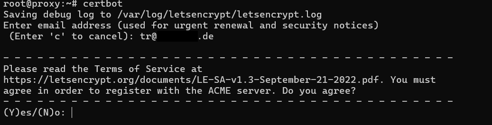
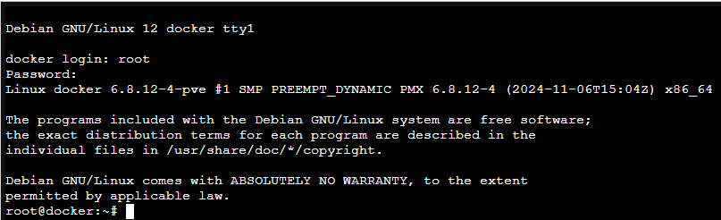
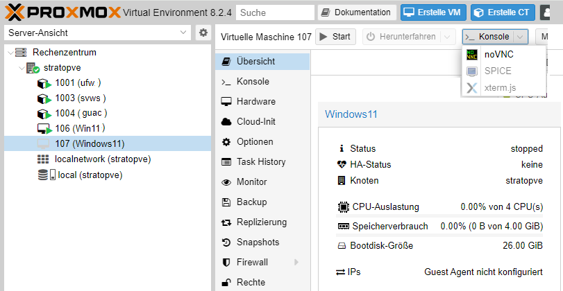

# Aufgabenstellung
Die 2024 vorgestellte Schulverwaltungssoftware des Landes Nordrhein-Westfalen besteht aus einem SVWS-Server, der wiederum auf eine MariaDB-Datenbank zugreift sowie aus der Software SchILD-NRW.
Im Rahmen einer Online-Schulung braucht man eine Möglichkeit, viele Rechner mit den dazugehörigen Datenbankservern bereit zu stellen.

Die Lösungs besteht darin, sich einen Server zu mieten und darauf die Virtualisierungsumgebung Proxmox zu installiern.

# Lösungsansatz

<!--  -->

**Firmeninformation**   
| **Firma:** | Proxmox Server Solutions GmbH |
|-----|-----|
|**Adresse:** | Bräuhausgasse 37, 1050 Vienna, Austria|
| E-Mail: |office@proxmox.com|
| URL | https://www.proxmox.com|
| **Firmenbuchnummer:**   | FN 258879f|
|**Firmenbuchgericht:** | Handelsgericht Wien|
|**Geschäftsführer:** | Martin Maurer, Tim Marx|
|UID-Nr.: |ATU 61587900|

# Ausblick

# PROXMOX auf einem Internet-Server installieren.
Die jeweilge intallation des Linux: Debian 12 "brookworm" hängt von dem Mietserver-Betreiber ab. 
Nach der Installation melden wir uns per Textconsole mit der Eingabe `ssh root@Die-IP-Adresse` am Server an.   
Aktualisieren und Installieren des Debian 12 geschieht mit der Eingabe  

	apt update && apt upgrade -y && apt autoremove -y && apt install -y mc

_Anpassen der Datei /etc/hosts und der Datei /etc/hostname (bei HETZNER)_  
Mit `mcedit /etc/hosts` ändern wir die Eintragung  
**Die-IP-Adresse Debian-bookworm-latest-amd64-base** in **Die-IP-Adresse pve.deine-domain pve**  
und ändern die Zeile **127.0.0.1 localhost** in **127.0.0.1 localhost.localdomain localhost**  
Mit `mcedit /etc/hostname` ändern wir die Eintragung **Debian-bookworm-latest-amd64-base** in **pve**  
_Anpassen der Datei /etc/hosts und der Datei /etc/hostname (bei STRATO)_  
Mit `mcedit /etc/hosts` ändern wir die Eintragung  
**127.0.1.1 h3014859.stratoserver.net h3014859** in **Die-IP-Adresse pve.deine-domain pve**  
und ändern die Zeile **127.0.0.1 localhost** in **127.0.0.1 localhost.localdoain localhost**  
Mit `mcedit /etc/hostname` ändern wir die Eintragung **h3014859.stratoserver.net h3014859** in **pve**  

# !!! ACHTUNG nur bei einem STRATO-Server !!!
**ANFANG: Änderungen für den STRATO-Server**   
Um Proxmox installieren zukönnen müßen wir Änderungen in **/etc/networks/interfaces** vornehmen.  
Mit dem Befehl `ip a` finden wir die Netzwerkeinstellungen:  
  
Unsere Netzwerkschnittstelle heißt **eno1** die IP-Addresse ist: **xxx.xxx.xxx.xxx** mit der Subnetmaske: **255.255.255.255** oder **/32**.  
Mit dem Befehl `ip r` ermitteln wir den gateway.  
  
Unser Gateway wird angezeigt  
Eintragungen **/etc/network/interfaces VORHER**  
  
Mit `mcedit /etc/network/interfaces` ändern wir die Eintragungen wie untenstehend ab.  
Eintragungen **/etc/network/interfaces NACHHER**  
**_!!!BITTE DIE NETZWERK-ANGABEN DEM ENTSPRECHEND ANPASSEN!!!!_**  
  
**ENDE: Änderungen für den STRATO-Server**  

**Jetzt starten wir des System mit der Eingabe `systemctl reboot` neu.**  
_SSH-Dienst absichern_  
Jetz legen wir mit `useradd -m {Benutzername}` einen neuen Benutzer an, und mit `passwd {Benutzername}` erstellen wir das Passwort.

Sicherungskopie der Originalen sshd_config Datei erstellen `cp /etc/ssh/{sshd_config,sshd_config.orig}`

Um nur ausgewählten Benutzern den Zugung über den SSH-Dienst zu erlauben, erstellen wir mit `groupadd sshgroup` die neue Gruppe mit Namen sshgroup.  
Mit der Eingabe (_Bitte nicht Kopieren!!_) `usermod –a -G sshgroup {Benutzername}` weisen wir den Benutzer der **sshgroup** zu.  
Löschen der vom System automatisch erstellte SSH-Key mit Befehl `rm /etc/ssh/ssh_host`

SSH-Key ed25519 erstellen 

    sh-keygen -o -a 9999 -t ed25519 -N "" -f /etc/ssh/ssh_host_ed25519_key -C "$(whoami)@$(hostname)-$(date -I)"
  
SSH-Key rsa erstellen 

    ssh-keygen -o -a 9999 -t rsa -N "" -f /etc/ssh/ssh_host_rsa_key -C "$(whoami)@$(hostname)-$(date -I)"

Download der neuen SSH-Serverkonfiguration: sshd_config  

    wget https://raw.githubusercontent.com/TheoRichter/Schulungsumgebung/refs/heads/main/downloads/sshd_config

    mv sshd_config /etc/ssh/

Nach dem Download überschreiben wir den alten Inhalt der Datei im Verzeichniss /etc/ssh/sshd_config.  
SSH-Dienst restarten: `systemctl restart ssh`

Status SSH-Dienst überpüfen: `systemctl status --lines=20 ssh`

_Vorbereitung der Proxmox Installation._  
Um Proxmox zu installieren benötigen wir noch einige Programme: `apt install -y curl htop lsof ethtool ifupdown2`

Jetzt Booten wir unseren Server neu mit `systemctl reboot`

In die Datei /etc/apt/sources.list den Eintrag  

    echo "deb [arch=amd64] http://download.proxmox.com/debian/pve bookworm pve-no-subscription" > /etc/apt/sources.list.d/pve-install-repo.list

für das Proxmox VE-Repository hinzufügen.  
Mit dem Befehl  

    wget https://enterprise.proxmox.com/debian/proxmox-release-bookworm.gpg -O /etc/apt/trusted.gpg.d/proxmox-release-bookworm.gpg

wird der Proxmox VE-Repository-Schlüssel hinzugefügt. Bitte den Befehl als root (oder als sudo) ausführen.  
verifizieren `sha512sum /etc/apt/trusted.gpg.d/proxmox-release-bookworm.gpg`

Die Ausgabe müsste genau so aussehen:  
> 7da6fe34168adc6e479327ba517796d4702fa2f8b4f0a9833f5ea6e6b48f6507a6da403a274fe201595edc86a84463d50383d07f64bdde2e3658108db7d6dc87 /etc/apt/trusted.gpg.d/proxmox-release-bookworm.gpg  

Jetzt aktualisieren wir das Sytem mit der Eingabe **_apt update && apt full-upgrade -y_**  
Installation des Proxmox VE Kernels mit dem Befehl **_apt install -y proxmox-default-kernel_**  
Neustarten des Rechners mit **_systemctl reboot_**  
Installation des Proxmox VE Pakete mit dem Befehl **_apt install -y proxmox-ve postfix open-iscsi chrony_**  
Entfernen des Debian-Kernels mit dem Befehl ___apt remove linux-image-amd64 'linux-image-6.1*'___  
_Anmeldung bei der Proxmox VE_  
Auf unserem Windows PC öffnen wir einen Browser und geben die IP-Adresse unserer Proxmox VE ein.  
https://Die-IP-Addresse:8006  
Wenn alles geklappt erscheint diese Bildschirmausgabe.  
  
_Hier die Eingabe Daten der ersten Anmeldung_  
  
_Netzwerkeinstellungen_  
Erstellen der Linux Bridge vmbr0 mit der IP 10.1.0.2/24 und der Linux Bridge vmbr1 mit der IP 10.0.0.0/31  
  
_Ergänzungen in der in der Datei /etc/network/interfaces_  
Eintragungen **HETZNER /etc/network/interfaces VORHER**  
  
Eintragungen **STRATO /etc/network/interfaces VORHER**  
  
Mit **_mcedit /etc/network/interfaces_** ändern wir die Eintragungen wie untenstehend ab.  
Eintragungen **/etc/network/interfaces NACHHER**  
**_!!!BITTE DIE NETZWERK-ANGABEN DEM ENTSPRECHEND ANPASSEN!!!!_**  
  
_Vorbereitung der Installation von LXC-Containern_
Um LXC-Container zu Erstellen müssen wir die zwei Templates hier Speichern:  
  
## Installation der UFW mit Certbot (Reverse-Proxy)
_Neuen LXC-Container mit 1CPU, 512KiB RAM und 2GB Festplattenspeicher benötigt._  
  
Nach der Anmeldung über die Konsole als Benutzer root laden wir die Datei: **ufw.sh** in das root Verzeichniss.  
**Download:**  
**_wget -q --show-progress https://raw.githubusercontent.com/TheoRichter/Schulungsumgebung/refs/heads/main/downloads/ufw.sh_**  
Mit dem Aufruf **_bash ufw.sh_** beginnt die Installation.  
Bei der Eingabe von https://Die-IP-Addresse:8006 im Browser erscheint diese Melung.  
  
Mit **certbot** wird diese Meldung verhindert.  
Hier werden die drei Datein im Ordner **/etc/ngnix/sites-available/** und die Links im Ordner **/etc/nginx/sites-enabled/** angezeigt.  
  
Im Ordner **/etc/ngnix/sites-available/** befinden sich diese drei Dateien.  
**Bitte in der Spalte den Eintrag hinter server_name durch Ihre Subdomain Ersetzen.**  
| docker.conf | guac.conf | pve.conf |
| :---        | :---      | :---     |
| server {    | server {  | server { |
| server_name docker.subdomain.de; | server_name guac.subdomain.de; | server_name pve.subdomain.de; |
| location / {  | location / {  | location / {  |
| proxy_pass      https://10.1.0.3:9443; | proxy_pass      https://10.1.0.4:3000; | proxy_pass      https://10.1.0.2:8006; |
| }    | }    | }    |
|      |      |      |
| proxy_set_header HOST $host; | proxy_set_header HOST $host;  | proxy_set_header HOST $host;  |
| proxy_set_header X-REAL-IP $remote_addr; | proxy_set_header X-REAL-IP $remote_addr; | proxy_set_header X-REAL-IP $remote_addr; |
| proxy_set_header X-Forward-For $proxy_add_x_forwarded_for; | proxy_set_header X-Forward-For $proxy_add_x_forwarded_for; | proxy_set_header X-Forward-For $proxy_add_x_forwarded_for; |
|       |       |       |
| proxy_set_header Upgrade $http_upgrade; | proxy_set_header Upgrade $http_upgrade; | proxy_set_header Upgrade $http_upgrade; |
| proxy_http_version 1.1; | proxy_http_version 1.1;  | proxy_http_version 1.1; |
| proxy_set_header Connection "upgrade"; | proxy_set_header Connection "upgrade"; | proxy_set_header Connection "upgrade"; |
|       |       |       |
| listen 80; | listen 80; | listen 80; |
| listen [::]:80; | listen [::]:80; | listen [::]:80;  |
|     |     |     |
| }   | }   | }   |

Mit der Eingabe **_certbot_** startet die Installation des Reverse-Proxies.  
  
Nach der Eingabe der Email-Addresse drücken wir Enter.  
  
Nach der Eingabe von **Y** mit Enter bestätigen.  
  
Ich habe auch **Y** eingegeben und mit Enter bestätigen. (Es geht bestimmt auch **N** dann gibt es keine Mails!)  
  
Hier stehen Ihr eingeben Subdomains.  
  
Bei der Eingabe von https://ihre-subdomain.de im Browser erschien die obige Melung jetzt nicht mehr.  
Als Beispiel hier mal https://stratopve.webolchi.de  
## Installation von Docker
_Neuen LXC-Container mit 7CPUs, 10240GB RAM und 41GB Festplattenspeicher benötigt._  
  
Nach der Anmeldung über die Konsole als Benutzer root laden wir die Datei: **docker-schulungen.sh** in das root Verzeichniss.  
  
**Download:**  
**_wget -q --show-progress https://raw.githubusercontent.com/TheoRichter/Schulungsumgebung/refs/heads/main/downloads/docker-schulungen.sh_**  
Mit **_bash docker-schulungen.sh_** beginnt die Installation   
  
Mit OK bestätigen.  
  
Mit OK bestätigen.  
  
Nach der Bestätigung mit OK müßte es jetzt so aussehen.  
  
Inhalt der Datei: schulungen-erklaerung.txt   
  
Nach der Anpassung der Datei **schulungen.txt** geben wir **_bash docker-container-schulungen.sh_** um mit der Installation fortzufahren.  
  
Mit der Eingabe **docker start portainer** starten wir den Portainer.  
Die Benutzeroberfläche von dem Portainer ist (wenn mit Certbot aktiviert) über folgende Url: **docker.subdomain.de** erreichbar.  
Beim ersten Aufruf der GUI muss ein Passwort mit 12 Zeichen vergeben werden.  
  
  
  
Um die SVWS-Server zu nutzen müssen wir die Container starten.
  

_SVWS-Server updaten_  
**docker-compose.yml:**  

version: "3.9"  
services:  
  svws-server:  
    image: svwsnrw/svws-server:**[Neue Versionsnummer Eintragen]**  
    ports:  
      - "10001:8443"  
    environment:  
      MariaDB_HOST: "${MariaDB_HOST}"  
      MariaDB_ROOT_PASSWORD: "${MariaDB_ROOT_PASSWORD}"  
      MariaDB_DATABASE: "${MariaDB_DATABASE}"  
      MariaDB_USER: "${MariaDB_USER}"  
      MariaDB_PASSWORD: "${MariaDB_PASSWORD}"  
      SVWS_TLS_KEY_ALIAS: "${SVWS_TLS_KEY_ALIAS}"  
      SVWS_TLS_KEYSTORE_PATH: "${SVWS_TLS_KEYSTORE_PATH}"  
      SVWS_TLS_KEYSTORE_PASSWORD: "${SVWS_TLS_KEYSTORE_PASSWORD}"  
    volumes:  
      - [path to keystore]:/etc/app/svws/conf/keystore  
Aktualisieren mit **_docker pull svwsnrw/svws-server_** in dem jeweiligen Verzeichniss.  

## Installation von Apache Guacamole
_Neuen LXC-Container mit 1CPU, 2GB RAM und 4GB Festplattenspeicher benötigt. Ausreichend für 25 Benutzer._  
  
_!!!Installierbar leider nur mit Template debian-11-standard_11.7-1_amd64.tar.zst!!!_
Nach der Anmeldung über die Konsole als Benutzer root laden wir die Datei: **guac_debian11_install_upgrade_debian12.sh** in das root Verzeichniss.  
**Download:**  
**_wget -q --show-progress https://raw.githubusercontent.com/TheoRichter/Schulungsumgebung/refs/heads/main/downloads/guac_debian11_install_upgrade_debian12.sh_**  
Mit dem Aufruf **_bash guac_debian11_install_upgrade_debian12.sh_** beginnt die Installation.  
BITTE nach dem Neustart den Status des Tomcat9 mit **_systemctl status tomcat9 --no-pager_**  
und den Status des Guacamole-Servers mit **_systemctl status guacd --no-pager_** Überprüfen.  
Die Benutzeroberfläche von von Apache Guacamole ist (wenn mit Certbot aktiviert) über folgende Url: **guac.subdomain.de** erreichbar.  
  
  
  
  
  
  
  
  
## Vorbereitung der Installation von Windows 11
Um Windows 11 zu installieren müssen wir die drei ISOs hier Speichern:  
  
  
_Download-Adresse **Windows 11**:_ https://www.microsoft.com/de-de/software-download/windows11  
  
  
_Download-Adresse **unattend.iso**:_ https://schneegans.de/windows/unattend-generator/  
  
_Download-Adresse **virtio-win-0.1.240.iso**:_ https://fedorapeople.org/groups/virt/virtio-win/direct-downloads/archive-virtio/virtio-win-0.1.240-1/virtio-win-0.1.240.iso  
## Installation von Windows 11
Mit  wir eine neue virtuelle Maschine erstellt.  
**Die Angaben für VM ID: und Name: bitte Anpassen.**  
  
  
  
**Bei Disk-Größe(GiB): die Zahl 26 auf die Zahl 41 Ändern.**  
  
  
  
  
  
  
  
  
  
**Hier steht dann bei Gesamtgröße 41.0 GB und bei Freier Speich: 41.0 GB**  
  
  
  
  
  
  
## Automatisches Update und Upgrade
  
Download der Dateien **_pveupgrade.sh_** und **_reboot.sh_**:   
**_wget -q --show-progress https://raw.githubusercontent.com/TheoRichter/Schulungsumgebung/refs/heads/main/downloads/pveupgrade.sh_**  
**_wget -q --show-progress https://raw.githubusercontent.com/TheoRichter/Schulungsumgebung/refs/heads/main/downloads/reboot.sh_**  
in das Verzeichniss: **/usr/local/sbin** und Eintragung der folgenden Zeilen in die Datei **/etc/[crontab](./downloads/crontab_pve)**  
**1 1	* * *	root	/usr/local/sbin/pveupgrade.sh**  
**1 3	1 1,2,3,4,5,6,7,8,9,10,11,12 *	root	/usr/local/sbin/reboot.sh**  
  
,  und   
Download der Datei **_update.sh_**:   
**_wget -q --show-progress https://raw.githubusercontent.com/TheoRichter/Schulungsumgebung/refs/heads/main/downloads/update.sh_**  
in das Verzeichniss: **/usr/local/sbin** und Eintragung der Zeile in die Datei **/etc/[crontab](./downloads/crontab_lxc)**  
**1 1	* * *	root	/usr/local/sbin/update.sh**  

