# Wartung

Die Wartung geschieht von den virtuellen Windows-Computern aus. Über einen Browser erreicht man die Wartungsseite des Docker-Servers, der verantwortlich für den SVWS-Server,  die Datenbanken, den Notenmanager und WebLupo ist. Die IP-Adressen sind hier gelistet.

| vom Moderatorenrechner MOnn | vom Schulungsrechner PCnn |
|-----|-----|
|10.1.0.3| 10.10.10.2|

In dieser Anleitung wird die Wartung von einem Moderatorenrechner beschhrieben, es wird also die IP 10.1.0.3 verwendet.

## Starten und Beenden der Server

Es kann passieren, dass Schild keinen Zugriff auf die Datenbank erhält. Meist ist die Ursache, dass Server heruntergefahren sind und wieder gestartet werden müssen.

Dazu wählt man sich auf die Wartungsseite auf dem Docker-Rechnner ein. Der Benutzername lautet "fachberater" und für das Passwort benötigt man unbedingt eine Tasse Tee.

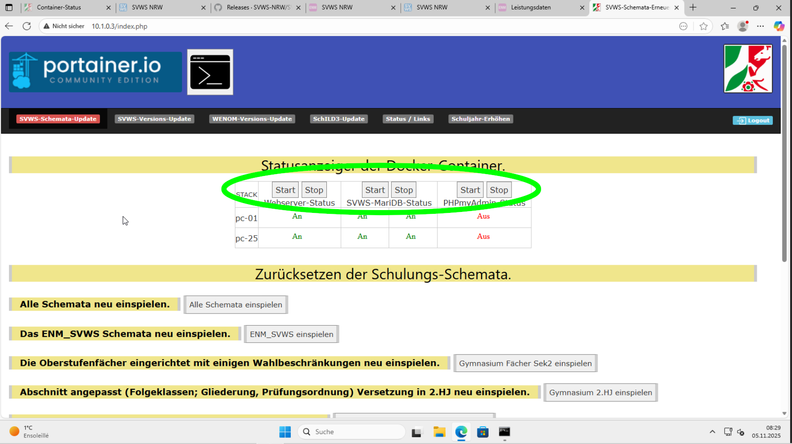

Im oberen Abschnitt kann man alle Server mit einem Klick starten. Eingetragen sind jeweils die ersten und letzten Computer. Wenn beide an sind, kann man davon ausgehen, dass alle anderen dazwischen ebennfalls eingeschaltet sind. 

Die Moderatorenrechner MO1 und MO2 sind mit den letzten beiden PCs verbunden. So ist in dieser Abbildung MO1 der PC-24 und MO2 der PC-25 zugewiesen. Somit bleiben in diesem Beispiel 23 Windows-Rechner für die Teilnehmer übrig.

* Der Webserver ist notwendig für WeNoM und WebLuPO und muss gestartet sein, wenn man diese Dienst zeigen will.
* Der SVWS- und MariaDB-Server sind natürlich die zentralen Server, ohne die Schild nicht läuft. Der muss immer laufen.
* Der PHPMyAdmin-Server ist nur notwendig, wenn man direkt in die Datenbank hineinsehen und dort am offenen Herzen operieren will. In der Regel kann er ausgeschaltet bleiben.

## Zurücksetzen der Datenbanken

Auf der Wartungsseite ist der zweite Abschnitt "Zurücksetzen der Schulungs-Schemata".

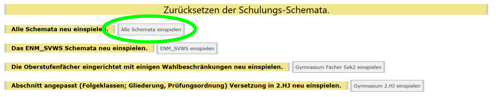

Die einfachste Möglichkeit ist, alle Schemata zurückzusetzen. Das passiert dann automatisch auf allen DB-Servern nacheinander. Das dauert größenordnungsmäßig eine Stunde!

Sollte man unter Zeitdruck stehen, z. B. in einer Schulung, so kann man auch einzelne Datenbanken zurücksetzen, das geht entsprechend schneller.

## Anbinden von WeNoM

Der WebNotenManager (WeNoM) muss vor der Benutzung mit dem richtigen Datenbankserver verheiratet werden.

## Einspielen einer neuen Server- und Schildversion

In regelmäßigen Abständen kommt eine neue Softwareversion heraus, so dass ein Update notwendig ist. Die dazu notwendigen Schritte werden jetzt beschrieben.

### Update von Schild3

Aus Performancegründen werden die übrigen Windows-Rechner in Proxmox heruntergefahren. Dann öffnet man einen Browser und gibt die URL 10.1.0.3 ein.

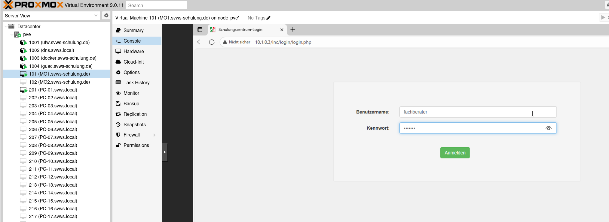

Der Benutername lautet "fachberater" und für das Passwort muss man eine Tasse Tee mit zwei Stück Zucker getrunken haben. Man kommt nun auf die Startseite der Wartungsoberfläche.

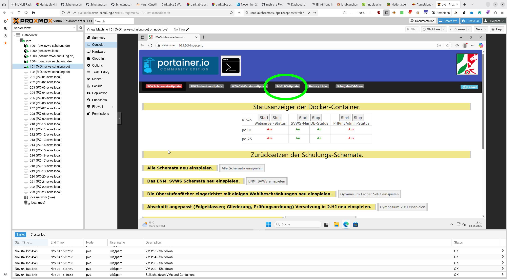

Hier klickt man auf Schild3-Update, was daraufhin nach vorne rutscht.

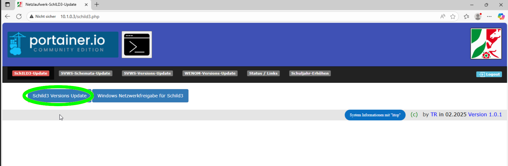

Als nächstes muss man Schild3 durch Klick auf den Link vom Github-Server herunterladen. Und sich die neue Versionsnummer merken.

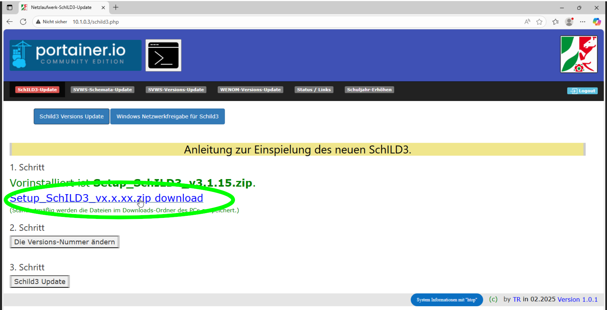

Im nächsten Schritt gibt man die neue Versionsnummer von Hand ein.

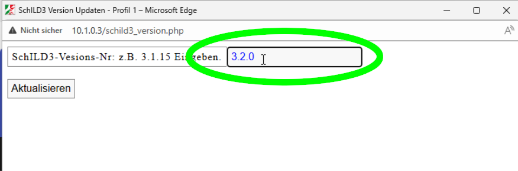

Nun nur noch auf "Aktualisieren" klicken, und schon ist Schild3 auf einer neuen Version.

### Update von WeNoM

Als Nächstes wird der WebNotenManager auf eine neue Version gebracht. Dazu klickt man oben in der Menüleiste der Wartungsseite auf "WENOM-Versions-Update", worauf dieser Button wieder nach vorne rutscht.

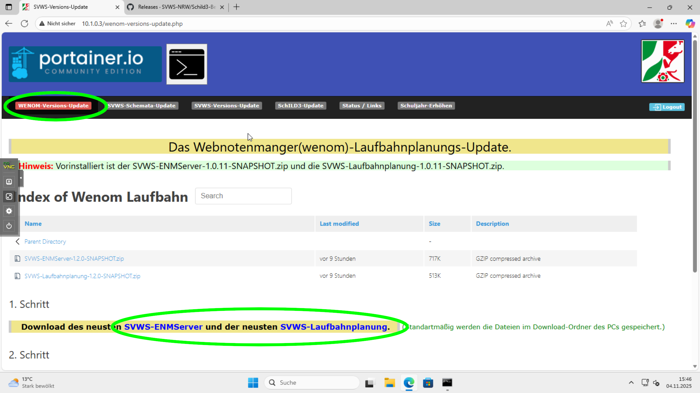

Über die Links muss man die neuesten SVWS-ENMServer sowie die Laufbahnplanung herunterladen. Diese werden normalerweise im Downloads-Ordner gespeichert. In einem zweite Schritt werden die beiden Zip-Dateien nacheinander hochgeladen. Schließlich klickt man nur noch auf "Das Update durchführen".

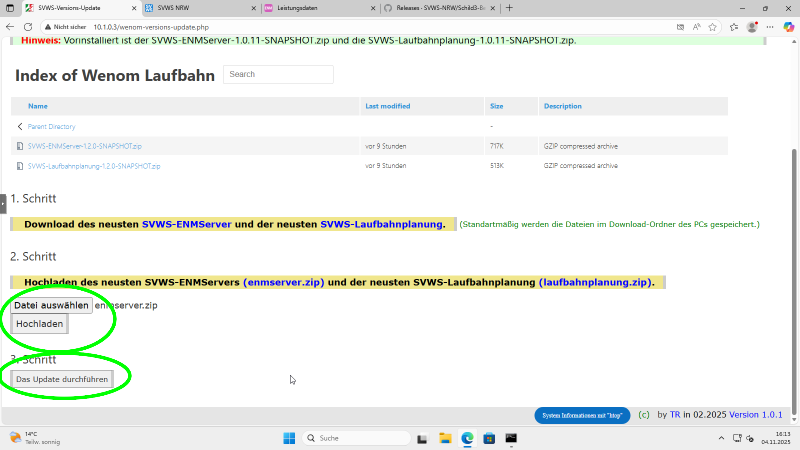

### SVWS-Server updaten

Zu guter Letzt ist der SVWS-Server mit dem Update an der Reihe. Dazu klickt man oben in der Menüleiste auf "SVWS-Versions-Update", worauf der Button wieder nach vorne rutscht. Dann muss man die Versionsnummern von der alten und der neuen Serverversion eintragen.

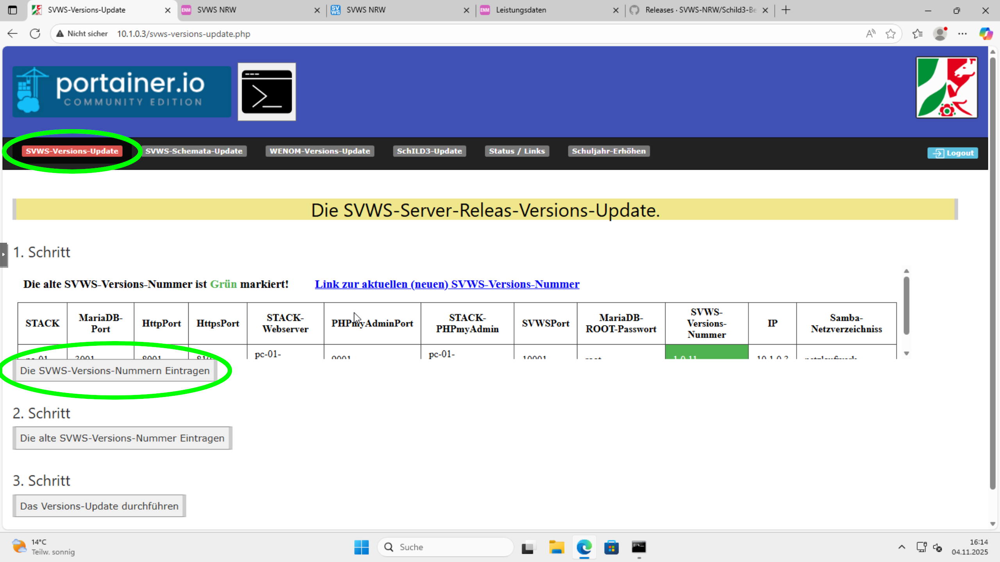

Bitte unbedingt beide Felder ausfüllen.

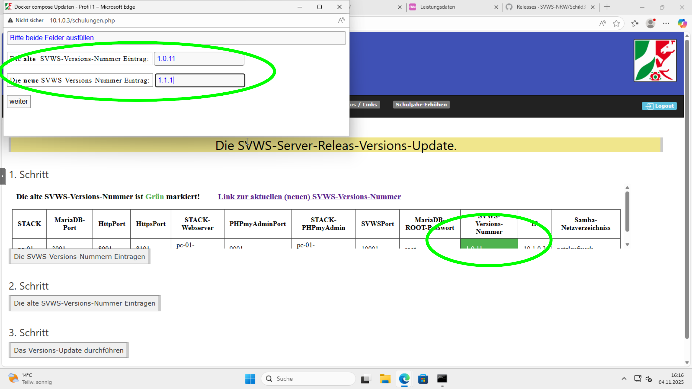

Nach einigen Augenblicken sollte sich die Versionsnummer in der Webseite geändert haben. Wenn das nicht der Fall sein sollte, hilft ein Neuladen der Seite mit Löschen des Browser-Caches. Beim Firefox drückt man dazu SHIFT+F5.

In einem zweiten Schritt gibt man die alte Versionsnummer noch einmal ein. Das scheint überflüssig zu sein, jedoch benötigt das Script eine erneute Eingabe.

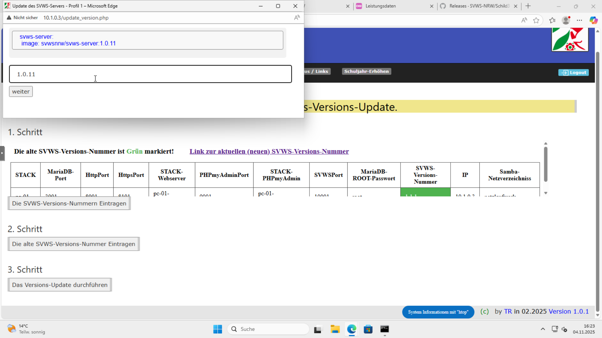

Zum Abschluss wird im 3. Schritt das Update durchgeführt. Dabei wird der alte SVWS-Server für jeden Client-PC gelöscht, der neue wird installiert und alle Datenbanken werden neu eingespielt. Das kann locker eine Stunde dauern. Also Geduld....
